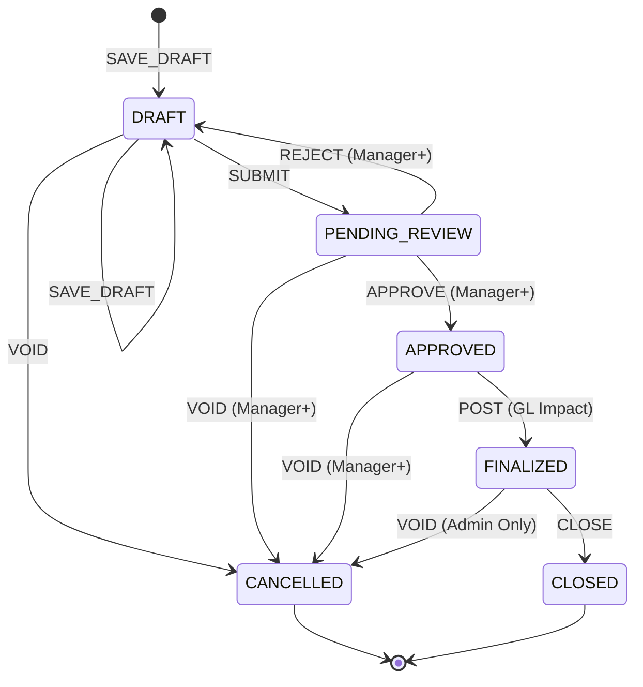

# ERP Document Lifecycle Design

This document outlines the strict lifecycle management for all ERP documents (Invoices, Purchase Orders, etc.), ensuring data integrity, auditability, and immutability.

## 1. State Machine Diagram

## 2. Core Immutability Rules

To maintain financial integrity, documents transition from mutable to immutable based on their state:

| State | Mutable? | Rationale |
| :--- | :--- | :--- |
| **DRAFT** | Yes | Initial data entry phase. |
| **PENDING_REVIEW** | No | Prevents changes while an authorizer is reviewing. |
| **APPROVED** | No | Must remain as approved; changes require rejection to DRAFT. |
| **FINALIZED** | **Strict No** | Document has impacted the General Ledger. Cannot be edited. |
| **CANCELLED** | **Strict No** | Audit record of a voided transaction. |
| **CLOSED** | **Strict No** | Archived record. |

## 3. Versioning Strategy

Instead of deleting or overwriting finalized data, the system uses a **Versioning & Revision** strategy:

1.  **Draft Versions**: Modifications in the `DRAFT` state overwrite the current record but are tracked in the `updatedAt` metadata.
2.  **Revision (The "Void & Replace" Pattern)**:
    *   To "edit" a `FINALIZED` document, the user must perform a `REVISE` action.
    *   The system automatically **Voids** the current document (marking it `CANCELLED`).
    *   A new document is created with `version = n + 1` and `parentUid = originalUid`.
    *   This preserves the full audit trail of how the document evolved.

## 4. Audit Logging (The Paper Trail)

Every state transition is recorded in a tamper-evident audit log. Each entry contains:

*   **Who**: User ID and Role.
*   **What**: The `LifecycleAction` performed.
*   **When**: ISO 8601 Timestamp.
*   **Integrity**: A SHA-256 `payloadHash` of the document at the moment of transition.
*   **Context**: A `reason` field (mandatory for Rejections and Voids).

## 5. Example Transition: Invoice Lifecycle

1.  **Creation**: User saves a new Invoice. State: `DRAFT`, Version: `1`.
2.  **Submission**: User clicks "Submit". State: `PENDING_REVIEW`. Document is now **Locked**.
3.  **Approval**: Manager reviews and clicks "Approve". State: `APPROVED`.
4.  **Posting**: System processes the invoice for accounting. State: `FINALIZED`. **GL Impact Created**.
5.  **Error Correction**: User realizes the quantity was wrong.
    *   User clicks "Void & Revise".
    *   Original Invoice (V1) moves to `CANCELLED`.
    *   New Invoice (V2) is created in `DRAFT` with corrected values.
    *   Audit log shows the link between V1 and V2.
