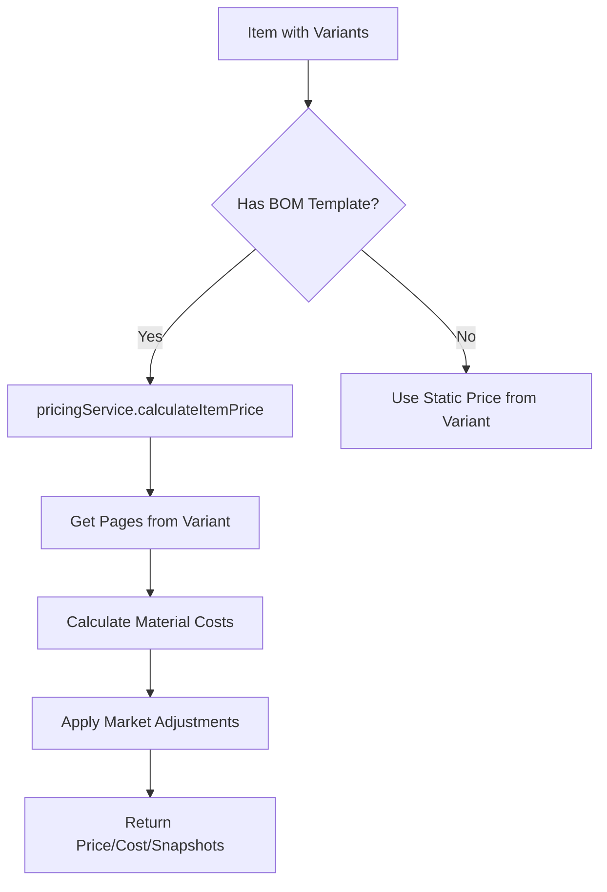
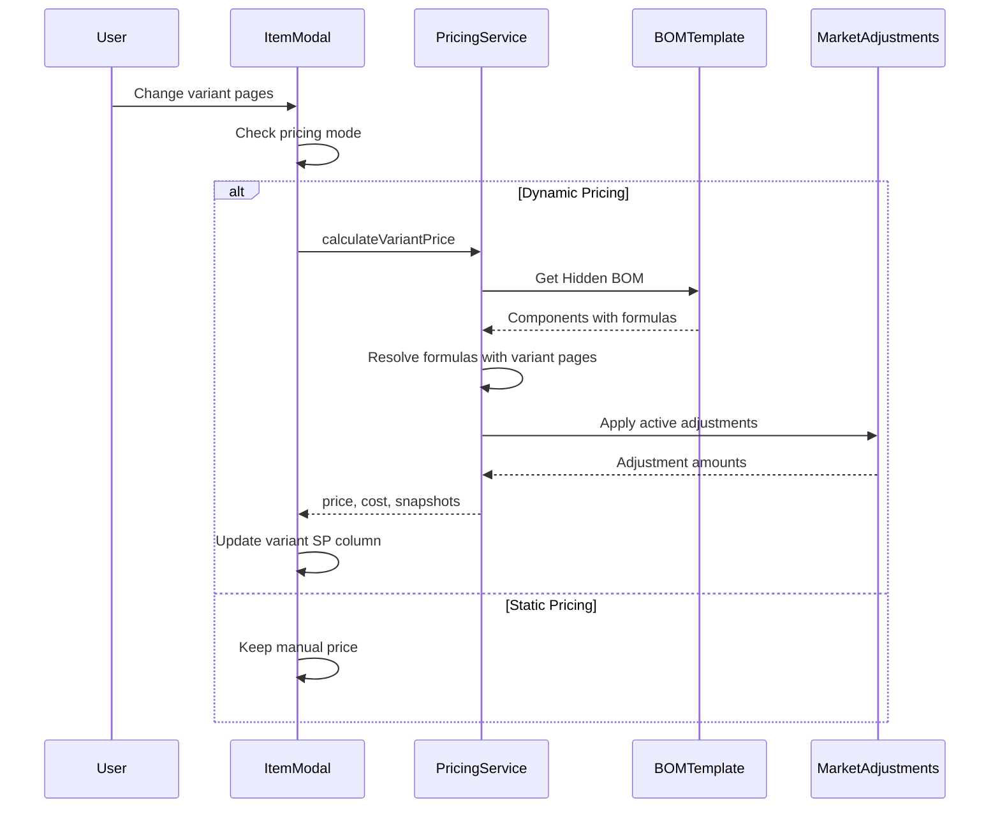

# Dynamic Variant Pricing Implementation Plan

## Overview

This plan outlines the implementation of dynamic pricing for product variants based on a "number of pages" attribute. The goal is to automatically update the Selling Price (SP) column when a variant's page count changes, using the parent product's Hidden BOM (Bill of Materials) as the cost basis.

## Current Architecture Analysis

### Existing Data Structures

#### ProductVariant (types.ts:158-179)
```typescript
interface ProductVariant {
  id: string;
  sku: string;
  name: string;
  attributes: Record<string, string | number>;
  price: number;          // Selling Price (SP)
  cost: number;           // Cost Price
  stock: number;
  pages: number;          // Key attribute for pricing
  pagesOverride?: number | null;
  adjustmentSnapshots?: AdjustmentSnapshot[];
  productionCostSnapshot?: ProductionCostSnapshot;
}
```

#### Item (Parent Product) (types.ts:50-105)
```typescript
interface Item {
  // ... other fields
  variants?: ProductVariant[];
  isVariantParent?: boolean;
  smartPricing?: SmartPricingConfig;  // Contains bomTemplateId
  pricingConfig?: PricingConfig;       // Paper, toner, finishing config
  pages: number;                       // Default pages for parent
}
```

#### BOMTemplate (types.ts:1422-1437)
```typescript
interface BOMTemplate {
  id: string;
  name: string;
  type: string;
  components: {
    itemId: string;
    name: string;
    quantityFormula: string;  // e.g., "quantity * pages / 2"
    unit: string;
    consumptionMode?: 'PAGE_BASED' | 'UNIT_BASED';
  }[];
  defaultMargin?: number;
  laborCost?: number;
}
```

### Current Pricing Flow



### Key Files Involved

| File | Purpose |
|------|---------|
| `services/pricingService.ts` | Core pricing calculation logic |
| `utils/pricing.ts` | `calculateItemFinancials()` helper |
| `services/bomService.ts` | BOM template resolution and formula evaluation |
| `views/inventory/components/ItemModal.tsx` | Variant creation/editing UI |
| `views/sales/components/OrderForm.tsx` | Order line item pricing |
| `views/pos/components/PosModals.tsx` | POS variant selection |

---

## Implementation Plan

### Phase 1: Data Structure Enhancements

#### 1.1 Extend ProductVariant Interface

Add fields to support dynamic pricing inheritance:

```typescript
// In types.ts
interface ProductVariant {
  // ... existing fields
  
  // New fields for dynamic pricing
  inheritsParentBOM?: boolean;        // Whether to use parent BOM for pricing
  bomOverrideId?: string;             // Optional specific BOM template
  calculatedAt?: string;              // Timestamp of last calculation
  pricingSource?: 'static' | 'dynamic'; // Pricing mode
}
```

#### 1.2 Add Hidden BOM Concept to Item

The parent product should store a reference to its "Hidden BOM":

```typescript
// In types.ts - extend SmartPricingConfig
interface SmartPricingConfig {
  // ... existing fields
  hiddenBOMId?: string;              // Reference to BOM template for variants
  variantPricingMode?: 'inherit' | 'independent'; // How variants get priced
  defaultPagesForCalculation?: number; // Base pages for parent (default: 1)
}
```

---

### Phase 2: Pricing Service Enhancement

#### 2.1 Create Variant-Specific Pricing Function

Add a new function to `services/pricingService.ts`:

```typescript
/**
 * Calculates variant price based on parent's Hidden BOM
 * Replaces parent's default page count with variant's specific page count
 */
calculateVariantPrice(
  parentItem: Item,
  variant: ProductVariant,
  quantity: number,
  inventory: Item[],
  bomTemplates: BOMTemplate[],
  marketAdjustments: MarketAdjustment[]
): PricingResult {
  // 1. Get the Hidden BOM from parent
  const hiddenBOMId = parentItem.smartPricing?.hiddenBOMId 
    || parentItem.smartPricing?.bomTemplateId;
  
  // 2. If no BOM, return variant's static price
  if (!hiddenBOMId) {
    return {
      price: variant.price,
      basePrice: variant.price,
      cost: variant.cost,
      // ... other fields
    };
  }
  
  // 3. Create a virtual item with variant's pages
  const virtualItem = {
    ...parentItem,
    pages: variant.pages,  // KEY: Replace parent pages with variant pages
    price: 0,              // Force BOM calculation
    cost: 0
  };
  
  // 4. Use existing pricing calculation
  return this.calculateItemPrice(
    virtualItem,
    quantity,
    undefined,  // variantId - we're using virtual item
    variant.pages,  // pagesOverride
    inventory,
    bomTemplates,
    marketAdjustments
  );
}
```

#### 2.2 Update BOM Component Formula Resolution

Enhance `services/bomService.ts` to handle variant attributes:

```typescript
resolveFormulaForVariant(
  formula: string, 
  parentAttributes: Record<string, any>,
  variantAttributes: Record<string, any>
): number {
  // Merge attributes with variant taking precedence
  const mergedAttributes = {
    ...parentAttributes,
    ...variantAttributes,
    pages: variantAttributes.pages || parentAttributes.pages || 1
  };
  
  return this.resolveFormula(formula, mergedAttributes);
}
```

---

### Phase 3: UI Updates

#### 3.1 ItemModal - Variant Pricing Section

Update `views/inventory/components/ItemModal.tsx`:

```typescript
// Add pricing mode selector in variant form
const VariantPricingSection = () => (
  <div className="space-y-3 p-4 bg-slate-50 rounded-lg">
    <h4 className="text-xs font-bold text-slate-600 uppercase">Pricing Mode</h4>
    
    <div className="flex gap-4">
      <label className="flex items-center gap-2">
        <input
          type="radio"
          name="pricingMode"
          value="dynamic"
          checked={newVariant.pricingSource === 'dynamic'}
          onChange={() => setNewVariant(prev => ({
            ...prev, 
            pricingSource: 'dynamic',
            inheritsParentBOM: true
          }))}
        />
        <span className="text-sm">Dynamic (from BOM)</span>
      </label>
      
      <label className="flex items-center gap-2">
        <input
          type="radio"
          name="pricingMode"
          value="static"
          checked={newVariant.pricingSource === 'static'}
          onChange={() => setNewVariant(prev => ({
            ...prev, 
            pricingSource: 'static',
            inheritsParentBOM: false
          }))}
        />
        <span className="text-sm">Static (manual)</span>
      </label>
    </div>
    
    {newVariant.pricingSource === 'dynamic' && (
      <div className="text-xs text-slate-500">
        Price will be calculated from parent BOM using {newVariant.pages || 1} pages
      </div>
    )}
  </div>
);
```

#### 3.2 Enhanced handleVariantPagesChange

```typescript
const handleVariantPagesChange = async (variantId: string, newPages: number) => {
  // Check if variant uses dynamic pricing
  const variant = formData.variants?.find(v => v.id === variantId);
  
  if (variant?.pricingSource === 'dynamic' || variant?.inheritsParentBOM) {
    // Calculate new price from BOM
    const result = await pricingService.calculateVariantPrice(
      formData as Item,  // Parent item
      { ...variant, pages: newPages },
      1,  // quantity
      inventory,
      bomTemplates,
      marketAdjustments
    );
    
    setFormData(prev => {
      const updatedVariants = (prev.variants || []).map(v => {
        if (v.id === variantId) {
          return {
            ...v,
            pages: newPages,
            cost: result.cost,
            price: result.price,
            adjustmentSnapshots: result.adjustmentSnapshots,
            productionCostSnapshot: result.consumption?.bomBreakdown 
              ? {
                  baseProductionCost: result.cost,
                  components: result.consumption.bomBreakdown,
                  totalPagesUsed: newPages,
                  source: 'VARIANT_PRICING' as const,
                  createdAt: new Date().toISOString()
                }
              : undefined,
            calculatedAt: new Date().toISOString()
          };
        }
        return v;
      });
      return { ...prev, variants: updatedVariants };
    });
  } else {
    // Static pricing - just update pages
    setFormData(prev => {
      const updatedVariants = (prev.variants || []).map(v => {
        if (v.id === variantId) {
          return { ...v, pages: newPages };
        }
        return v;
      });
      return { ...prev, variants: updatedVariants };
    });
  }
};
```

---

### Phase 4: Backend API Support

#### 4.1 Add Variant Price Calculation Endpoint

In `server/index.cjs`, add:

```javascript
// POST /api/calculate-variant-price
app.post('/api/calculate-variant-price', async (req, res) => {
  try {
    const { parentId, variantId, pages, quantity = 1 } = req.body;
    
    const parentItem = await db.get('inventory', parentId);
    if (!parentItem) {
      return res.status(404).json({ error: 'Parent item not found' });
    }
    
    const variant = parentItem.variants?.find(v => v.id === variantId);
    if (!variant) {
      return res.status(404).json({ error: 'Variant not found' });
    }
    
    const inventory = await db.getAll('inventory');
    const bomTemplates = await db.getAll('bomTemplates');
    const marketAdjustments = await db.getAll('marketAdjustments');
    
    const result = pricingService.calculateVariantPrice(
      parentItem,
      { ...variant, pages: pages || variant.pages },
      quantity,
      inventory,
      bomTemplates,
      marketAdjustments
    );
    
    res.json(result);
  } catch (error) {
    res.status(500).json({ error: error.message });
  }
});
```

---

### Phase 5: OrderForm and POS Integration

#### 5.1 OrderForm Updates

Update `views/sales/components/OrderForm.tsx`:

```typescript
const getInventoryPrices = async (item: CartItem) => {
  const invItem = inventory.find((i: Item) => i.id === (item.parentId || item.id));
  
  if (!invItem) return { price: item.price, cost: item.cost || 0 };
  
  // For variants with dynamic pricing
  if (item.parentId && invItem.variants) {
    const variant = invItem.variants.find(v => v.id === item.id);
    
    if (variant?.inheritsParentBOM || variant?.pricingSource === 'dynamic') {
      // Recalculate price based on current pages
      const result = await pricingService.calculateVariantPrice(
        invItem,
        { ...variant, pages: item.pagesOverride || variant.pages },
        item.quantity,
        inventory,
        bomTemplates,
        marketAdjustments
      );
      
      return {
        price: result.price,
        cost: result.cost,
        adjustmentSnapshots: result.adjustmentSnapshots
      };
    }
    
    // Static pricing
    if (variant) {
      return {
        price: variant.price,
        cost: variant.cost,
        adjustmentSnapshots: variant.adjustmentSnapshots
      };
    }
  }
  
  return {
    price: invItem.price,
    cost: invItem.cost,
    adjustmentSnapshots: invItem.adjustmentSnapshots
  };
};
```

#### 5.2 POS Variant Modal Updates

Update `views/pos/components/PosModals.tsx`:

```typescript
// In PrintingVariantModal
useEffect(() => {
  const updatePricing = async () => {
    // Check if parent has Hidden BOM
    if (product.smartPricing?.hiddenBOMId || product.smartPricing?.bomTemplateId) {
      const result = await pricingService.calculateVariantPrice(
        product,
        { pages: attributes.number_of_pages, attributes },
        quantity,
        materials,
        bomTemplates,
        marketAdjustments
      );
      
      setPricingState({
        baseCost: result.cost,
        sellingPrice: result.price,
        adjustmentTotal: result.adjustmentTotal,
        adjustmentBreakdown: result.breakdown,
        adjustmentSnapshots: result.adjustmentSnapshots
      });
    } else if (bom) {
      // Legacy BOM calculation
      const result = bomService.calculateVariantBOM(bom, { attributes }, materials);
      // ... existing logic
    }
  };
  
  updatePricing();
}, [attributes, bom, materials, product, quantity]);
```

---

## Data Flow Diagram



---

## Implementation Checklist

### Phase 1: Data Structures
- [ ] Extend `ProductVariant` interface with pricing mode fields
- [ ] Extend `SmartPricingConfig` with Hidden BOM fields
- [ ] Update type exports

### Phase 2: Pricing Service
- [ ] Add `calculateVariantPrice()` to `pricingService.ts`
- [ ] Add `resolveFormulaForVariant()` to `bomService.ts`
- [ ] Add unit tests for new functions

### Phase 3: UI Updates
- [ ] Add pricing mode selector to ItemModal variant form
- [ ] Update `handleVariantPagesChange()` for dynamic calculation
- [ ] Add visual indicator for dynamic vs static pricing
- [ ] Update variant list table to show pricing mode

### Phase 4: Backend API
- [ ] Add `/api/calculate-variant-price` endpoint
- [ ] Add validation and error handling
- [ ] Update API types

### Phase 5: Integration
- [ ] Update OrderForm `getInventoryPrices()`
- [ ] Update POS PrintingVariantModal
- [ ] Update transaction service for variant pricing

### Phase 6: Testing
- [ ] Test variant creation with dynamic pricing
- [ ] Test variant creation with static pricing
- [ ] Test pages change triggers recalculation
- [ ] Test order creation with dynamic variants
- [ ] Test POS flow with dynamic variants

---

## Migration Strategy

### Existing Variants
- Default to `pricingSource: 'static'` for backward compatibility
- Existing variants will continue using stored prices
- Users can opt-in to dynamic pricing per variant

### Parent Products
- Products with `smartPricing.bomTemplateId` automatically support variant pricing
- No migration needed - existing behavior preserved

---

## Risk Assessment

| Risk | Impact | Mitigation |
|------|--------|------------|
| Performance on large BOMs | Medium | Cache calculated prices, debounce UI updates |
| Formula errors | Low | Validate formulas on save, graceful fallback |
| Backward compatibility | High | Default to static pricing, explicit opt-in |
| Price drift from market changes | Medium | Add "Recalculate All Variants" action |

---

## Success Criteria

1. **Functional**: Variant SP automatically updates when pages change
2. **Accurate**: Calculated price matches manual BOM calculation
3. **Performant**: Price calculation completes within 500ms
4. **Compatible**: Existing variants continue to work unchanged
5. **Traceable**: Adjustment snapshots show calculation breakdown
