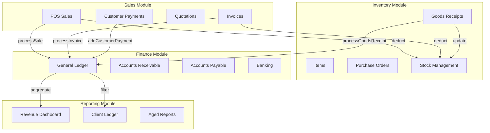
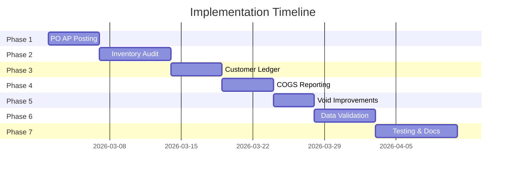

# Prime ERP System - Module Integration & Gap Resolution Plan

## Executive Summary

This plan addresses the identified missing links, logic gaps, and feature gaps across the customer, sales, inventory, finance, and reporting modules in the Prime ERP System.

---

## Current Architecture Overview

### Existing Data Flows

---

## Identified Gaps and Implementation Plan

### Phase 1: Purchase Order AP Posting Enhancement

**Current State:**
- [`processPurchaseOrder()`](services/transactionService.ts:3163) only saves PO without posting AP
- Supplier balance only updates on GRN, not on PO approval
- No ledger entry when PO is approved

**Gap:** Supplier balances/AP not increased on PO creation

**Implementation:**
1. Modify [`processPurchaseOrder()`](services/transactionService.ts:3163) to accept an `approve` flag
2. When PO is approved:
   - Debit: Inventory/Expense Account (or PO Receiving Account)
   - Credit: Accounts Payable
   - Update supplier.balance
3. When GRN is processed:
   - Reverse the PO AP entry
   - Post actual inventory entry
4. Add PO cancellation logic to reverse AP

**Affected Files:**
- `services/transactionService.ts` - update processPurchaseOrder, add approvePurchaseOrder logic
- `stores/procurementStore.ts` - update purchase approval workflow
- `context/ProcurementContext.tsx` - add approval UI integration

---

### Phase 2: Inventory Audit Trail Integration

**Current State:**
- [`inventoryTransactionService.ts`](services/inventoryTransactionService.ts:1) exists with full tracking capabilities
- Never used by [`InventoryContext.tsx`](context/InventoryContext.tsx:1) or [`transactionService.ts`](services/transactionService.ts:1)
- Stock updates happen directly without audit trail

**Gap:** Inventory audit trail is disconnected from actual operations

**Implementation:**
1. Integrate `inventoryTransactionService.deductInventory()` into:
   - [`InventoryContext.updateStock()`](context/InventoryContext.tsx:37)
   - [`transactionService._executeDeductInventory()`](services/transactionService.ts:255)
2. Integrate `inventoryTransactionService.addInventory()` into:
   - [`transactionService.processGoodsReceipt()`](services/transactionService.ts:3013)
   - [`InventoryContext.updateStock()`](context/InventoryContext.tsx:37) for positive adjustments
3. Add batch/lot tracking to all inventory operations
4. Create inventory movement report

**Affected Files:**
- `services/inventoryTransactionService.ts` - ensure complete implementation
- `context/InventoryContext.tsx` - integrate audit trail
- `services/transactionService.ts` - use audit service
- `views/reports/InventoryMovementReport.tsx` - new report (create)

---

### Phase 3: Customer Ledger Completeness

**Current State:**
- [`ClientLedger.tsx`](views/reports/ClientLedger.tsx:1) only shows AR ledger entries
- POS sales with outstanding balances update [`customer.balance`](services/transactionService.ts:920) but don't create AR entries
- Customer statements miss POS credit activity

**Gap:** Customer statements can miss POS credit activity

**Implementation:**
1. Create unified customer transaction query that includes:
   - Invoices (existing)
   - POS sales with outstanding > 0
   - Customer payments
   - Wallet transactions
2. Modify [`ClientLedger.tsx`](views/reports/ClientLedger.tsx:1) to use unified data
3. Create customer statement generation service
4. Ensure consistent balance calculation

**Affected Files:**
- `views/reports/ClientLedger.tsx` - enhance data sources
- `services/reportService.ts` - add getCustomerStatement function
- `context/DataContext.tsx` - add unified customer transaction getter

---

### Phase 4: COGS and Inventory Valuation Reporting

**Current State:**
- COGS is posted to ledger in [`processSale()`](services/transactionService.ts:901) and [`processInvoice()`](services/transactionService.ts:1851)
- [`RevenueDashboard.tsx`](views/reports/RevenueDashboard.tsx:62) pulls COGS from ledger
- No inventory valuation reporting

**Gap:** Inventory valuation isn't reflected in reporting

**Implementation:**
1. Enhance [`RevenueDashboard.tsx`](views/reports/RevenueDashboard.tsx:1):
   - Add gross margin calculation (Revenue - COGS)
   - Add margin by product/category
2. Create inventory valuation report:
   - FIFO/LIFO/Average cost methods
   - Current stock value
   - Stock aging
3. Add COGS by product report
4. Create inventory turnover metrics

**Affected Files:**
- `views/reports/RevenueDashboard.tsx` - add margin metrics
- `views/reports/InventoryValuationReport.tsx` - new report (create)
- `services/reportService.ts` - add valuation calculations

---

### Phase 5: Void and Reversal Improvements

**Current State:**
- [`voidInvoice()`](services/transactionService.ts:2676) handles reversals comprehensively
- No [`voidSale()`](services/transactionService.ts) function for POS
- Limited audit trail for reversals

**Gap:** Need consistent void capabilities across all transaction types

**Implementation:**
1. Review and enhance [`voidInvoice()`](services/transactionService.ts:2676):
   - Add period-based restrictions
   - Handle edge cases (partial payments, multiple allocations)
2. Create [`voidSale()`](services/transactionService.ts) function
3. Create reversal audit trail entity
4. Add void restrictions based on:
   - Accounting period status
   - User permissions
   - Transaction age

**Affected Files:**
- `services/transactionService.ts` - add voidSale, enhance voidInvoice
- `types.ts` - add ReversalAuditTrail type
- `context/SalesContext.tsx` - add voidSale UI integration

---

### Phase 6: Data Consistency and Validation

**Current State:**
- No automated reconciliation between modules
- Customer/supplier balances can drift from ledger
- Orphaned entries possible

**Gap:** Need data integrity validation

**Implementation:**
1. Create ledger reconciliation service:
   - Detect orphaned entries
   - Validate customer balances vs AR ledger
   - Validate supplier balances vs AP ledger
   - Reconcile inventory vs COGS postings
2. Add data integrity check job
3. Create automated balance correction suggestions
4. Add integrity check UI in admin panel

**Affected Files:**
- `services/reconciliationService.ts` - new service (create)
- `context/AuthContext.tsx` - add scheduled integrity checks
- `views/admin/DataIntegrityPanel.tsx` - new view (create)

---

### Phase 7: Testing and Documentation

**Implementation:**
1. Create integration tests:
   - PO → GRN → Payment workflow
   - Sale → Inventory → COGS → Ledger flow
   - Invoice → Payment → Bank reconciliation
   - Void operations across modules
2. Document data flow architecture
3. Create user guides for new features
4. Performance testing with large datasets

**Affected Files:**
- `tests/integration/` - new test suite (create)
- `docs/data-flow-architecture.md` - new documentation (create)
- `docs/user-guide-inventory-audit.md` - new guide (create)

---

## Implementation Sequence

---

## Key Technical Considerations

### Atomic Transactions
All cross-module operations must use [`dbService.executeAtomicOperation()`](services/db.ts) to ensure data consistency.

### Backward Compatibility
- Existing data must remain valid
- New fields should have sensible defaults
- Migration scripts may be needed for:
  - Populating missing audit trail records
  - Reconciling existing balance discrepancies

### Performance
- Audit trail tables will grow large
- Implement pagination for all list views
- Consider archiving old transactions
- Add database indexes for common queries

### Security
- All financial operations need audit logging
- Void operations require elevated permissions
- Balance corrections must be traceable

---

## Success Criteria

1. **PO Workflow**: Supplier balance accurately reflects both PO and GRN liabilities
2. **Inventory Audit**: Every stock movement has a traceable audit record
3. **Customer Ledger**: Customer statements include all transaction types
4. **Reporting**: Gross margin and inventory valuation reports are accurate
5. **Data Integrity**: Automated checks detect and help resolve discrepancies
6. **Test Coverage**: >80% coverage for cross-module transactions

---

## Files to be Modified/Created

### Modified Files (15)
- `services/transactionService.ts`
- `services/inventoryTransactionService.ts`
- `services/reportService.ts`
- `context/SalesContext.tsx`
- `context/FinanceContext.tsx`
- `context/InventoryContext.tsx`
- `context/ProcurementContext.tsx`
- `context/DataContext.tsx`
- `stores/procurementStore.ts`
- `views/reports/RevenueDashboard.tsx`
- `views/reports/ClientLedger.tsx`
- `types.ts`
- `context/AuthContext.tsx`

### New Files (8)
- `services/reconciliationService.ts`
- `views/reports/InventoryMovementReport.tsx`
- `views/reports/InventoryValuationReport.tsx`
- `views/admin/DataIntegrityPanel.tsx`
- `tests/integration/transactionFlow.test.ts`
- `docs/data-flow-architecture.md`
- `docs/user-guide-inventory-audit.md`
- `scripts/migrateAuditTrail.ts`

---

## Risk Assessment

| Risk | Impact | Mitigation |
|------|--------|------------|
| Data migration errors | High | Backup database before migration; test in staging |
| Performance degradation | Medium | Add pagination; implement archiving strategy |
| User confusion | Low | Provide training; create documentation |
| Integration bugs | Medium | Comprehensive integration testing |

---

*Plan created: 2026-03-01*
*Version: 1.0*
