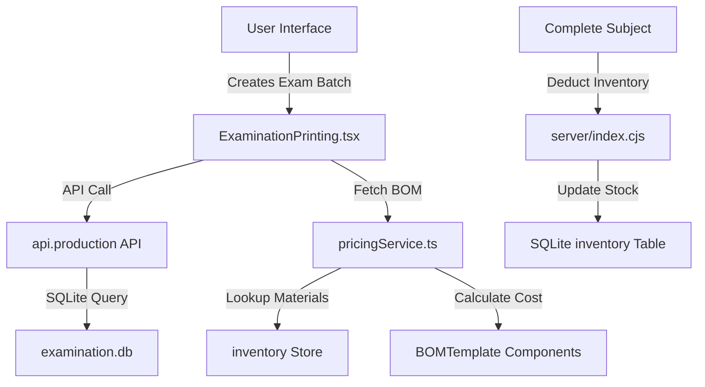
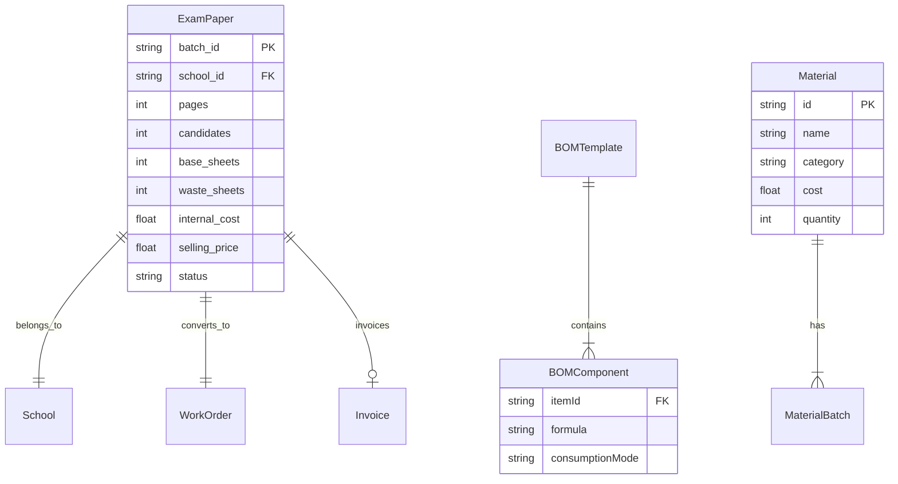

# Examination Module BOM Integration Analysis & Implementation Plan

## Executive Summary

This document provides a comprehensive technical analysis of the Prime ERP System's examination module, specifically focusing on the integration of hidden Bill of Materials (BOM) for paper and toner into automated cost calculations and inventory deduction logic. The analysis identifies current limitations and proposes comprehensive feature upgrades tailored to the regulatory and infrastructural context of Malawi.

---

## Table of Contents

1. [Current Architecture Overview](#1-current-architecture-overview)
2. [BOM Integration Analysis](#2-bom-integration-analysis)
3. [Cost Calculation Logic Deep Dive](#3-cost-calculation-logic-deep-dive)
4. [Inventory Deduction Mechanisms](#4-inventory-deduction-mechanisms)
5. [Current Limitations & Gaps](#5-current-limitations--gaps)
6. [Proposed Feature Upgrades](#6-proposed-feature-upgrades)
7. [Malawi Context Considerations](#7-malawi-context-considerations)
8. [Phased Implementation Roadmap](#8-phased-implementation-roadmap)
9. [Technical Recommendations](#9-technical-recommendations)

---

## 1. Current Architecture Overview

### 1.1 System Components

The examination module consists of the following key components:

| Component | Location | Purpose |
|-----------|----------|---------|
| ExaminationPrinting.tsx | `views/production/` | Frontend UI for exam management |
| ExaminationInvoice.tsx | `components/` | Invoice generation component |
| api.ts | `services/` | Frontend API service layer |
| index.cjs | `server/` | Backend SQLite-based API endpoints |
| pricingService.ts | `services/` | Cost calculation engine |
| bomService.ts | `services/` | BOM management service |
| types.ts | Root | TypeScript type definitions |

### 1.2 Data Flow Architecture



---

## 2. BOM Integration Analysis

### 2.1 Current BOM Structure

The system supports two BOM-related structures:

#### BOMTemplate (Production Recipe)
```typescript
interface BOMTemplate {
  id: string;
  name: string;
  type: string;
  components: {
    itemId: string;
    name: string;
    quantityFormula: string;  // e.g., "quantity * pages / 2"
    unit: string;
    consumptionMode?: 'PAGE_BASED' | 'UNIT_BASED';
    costRole?: 'production' | 'inventory' | 'both';
  }[];
  defaultMargin?: number;
  laborCost?: number;
  lastUpdated?: string;
}
```

#### BillOfMaterial (Instance)
```typescript
interface BillOfMaterial {
  id: string;
  itemId: string;
  templateId?: string;
  components: (BOMComponent & { name?: string; unit?: string; cost?: number; itemId?: string })[];
  totalCost: number;
  laborCost?: number;
  laborFormula?: string;
  priceFormula?: string;
  lastCalculated: string;
  productionCostSnapshot?: ProductionCostSnapshot;
}
```

### 2.2 Hidden BOM Integration

The system implements a "Hidden BOM" pattern through the `SmartPricingConfig`:

```typescript
interface SmartPricingConfig {
  pricingModel: 'per-page' | 'per-learner' | 'per-book' | 'per-job' | 'cost-plus';
  bomTemplateId?: string;
  baseMargin: number;
  marketAdjustmentId?: string;
  hiddenBOMId?: string;  // Hidden BOM for variant pricing
  variantPricingMode?: 'inherit' | 'independent';
  defaultPagesForCalculation?: number;
}
```

### 2.3 BOM Formula Evaluation

The system uses formula-based BOM component calculation:

```typescript
// From bomService.ts
resolveFormula(formula: string, attributes: Record<string, any>): number {
  let expression = formula;
  const sortedKeys = Object.keys(attributes).sort((a, b) => b.length - a.length);
  sortedKeys.forEach(key => {
    const value = attributes[key];
    const escapedKey = key.replace(/\./g, '\\.');
    const regex = new RegExp(`(?<![a-zA-Z0-9._])${escapedKey}(?![a-zA-Z0-9._])`, 'g');
    expression = expression.replace(regex, value.toString());
  });
  // Safety check: only allow numbers, operators, and decimal points
  if (!/^[0-9+\-*/().\s]+$/.test(expression)) return 0;
  return new Function(`return ${expression}`)();
}
```

---

## 3. Cost Calculation Logic Deep Dive

### 3.1 Primary Cost Calculation Flow

The examination module uses two parallel cost calculation paths:

#### Path 1: calculateSubjectCost() (Frontend)
Located in `views/production/ExaminationPrinting.tsx`:

```typescript
const calculateSubjectCost = (subj: SubjectJob) => {
  const pages = parseInt(subj.pages.toString()) || 0;
  const candidates = parseInt(subj.candidates.toString()) || 0;
  const extra_copies = parseInt(subj.extra_copies.toString()) || 0;

  const sheets_per_copy = Math.ceil(pages / 2);
  const production_copies = candidates + extra_copies;
  const base_sheets = sheets_per_copy * production_copies;
  const waste_sheets = Math.ceil(base_sheets * 0.05);  // 5% waste factor
  const total_sheets = base_sheets + waste_sheets;

  let materialCost = 0;
  let toner_kgs = 0;

  // BOM-based material calculation
  if (examBOM && examBOM.components) {
    examBOM.components.forEach((comp: any) => {
      const item = (inventory || []).find(i => i.id === comp.materialId);
      const unitCost = item?.cost || 0;
      let quantity = comp.quantity || 0;

      if (comp.formula) {
        // Formula evaluation with variables
        let formula = comp.formula
          .replace(/pages/g, pages.toString())
          .replace(/candidates/g, candidates.toString())
          .replace(/total_sheets/g, total_sheets.toString())
          .replace(/production_copies/g, production_copies.toString());
        quantity = eval(formula);
      }

      materialCost += (quantity * unitCost);
    });
  }

  const laborCost = (examBOM.laborCost || 10);
  const base_internal_cost = laborCost + materialCost;

  return {
    sheets_per_copy,
    production_copies,
    base_sheets,
    waste_sheets,
    total_sheets_used: total_sheets,
    internal_cost: base_internal_cost,
    adjustmentTotal,
    adjustmentSnapshots,
    toner_kgs
  };
};
```

#### Path 2: Backend Calculation (server/index.cjs)
```typescript
// Complete subject endpoint
const actual_toner_usage_mg = actual_total_sheets * TONER_MG_PER_SHEET;
const actual_internal_cost_per_sheet = paper.cost_per_unit + (toner.cost_per_unit * TONER_MG_PER_SHEET);
const actual_internal_cost = actual_total_sheets * actual_internal_cost_per_sheet;
```

### 3.2 Pricing Models Supported

| Model | Description | Formula |
|-------|-------------|---------|
| per-page | Charge based on total pages | `sheets × price_per_sheet` |
| per-learner | Charge per candidate | `candidates × price_per_learner` |
| per-book | Fixed price per exam booklet | `copies × price_per_book` |
| cost-plus | Cost + margin | `internal_cost × (1 + margin)` |

### 3.3 Market Adjustments Integration

The system integrates market adjustments through the pricing service:

```typescript
// From pricingService.ts
marketAdjustments.forEach(adj => {
  const isActive = adj.active ?? adj.isActive;
  const categoryMatch = !adj.applyToCategories || adj.applyToCategories.includes(item.category);

  if (isActive && categoryMatch) {
    let amount = 0;
    if (adj.type === 'PERCENTAGE' || adj.type === 'PERCENT') {
      amount = calculatedPrice * (adj.percentage || adj.value) / 100;
    } else {
      amount = adj.value;
    }
    adjustmentTotal += amount;
  }
});
```

---

## 4. Inventory Deduction Mechanisms

### 4.1 Current Implementation

Inventory deduction occurs at exam completion in `server/index.cjs`:

```typescript
// Complete subject endpoint - Lines 992-994
db.run("UPDATE inventory SET quantity = quantity - ? WHERE material = 'Paper'", [actual_total_sheets]);
db.run("UPDATE inventory SET quantity = quantity - ? WHERE material = 'Toner'", [actual_toner_usage_mg]);
```

### 4.2 Inventory Detection Logic

The current system uses string matching for material detection:

```typescript
// From ExaminationPrinting.tsx - Line 366
const item = (inventory || []).find(i => i.id === comp.materialId);
// OR fallback detection
const paperItem = (inventory || []).find(i => i.name?.toLowerCase()?.includes('paper'));
const tonerItem = (inventory || []).find(i => i.name?.toLowerCase()?.includes('toner'));
```

### 4.3 Consumption Snapshot

The system captures consumption data through the `ConsumptionSnapshot` type:

```typescript
interface ConsumptionSnapshot {
  id: string;
  saleId: string;
  itemId: string;
  variantId?: string;
  pages: number;
  paperConsumed: number;  // in reams
  tonerConsumed: number;   // in kg
  costPerUnit: number;
  bomBreakdown: {
    materialId: string;
    materialName: string;
    quantity: number;
    unit: string;
    cost: number;
  }[];
  timestamp: string;
}
```

---

## 5. Current Limitations & Gaps

### 5.1 Critical Limitations

| # | Limitation | Impact | Severity |
|---|------------|--------|----------|
| 1 | **Hardcoded Material Detection** | Uses string matching (`name.toLowerCase().includes('paper')`) instead of proper categorization | High |
| 2 | **Unsafe Formula Evaluation** | Uses `eval()` for BOM formulas - security risk | High |
| 3 | **No Multi-Warehouse Support** | Inventory deduction doesn't consider warehouse locations | Medium |
| 4 | **No Batch/Lot Tracking** | Paper batches not tracked for quality/recall purposes | Medium |
| 5 | **No Toner Cartridge Management** | Tracked by weight, not by cartridge unit | Low |
| 6 | **ConsumptionSnapshot Not Fully Utilized** | Type exists but not persisted for exam papers | Medium |
| 7 | **No Offline Support** | Module requires server connection | High |
| 8 | **No Audit Trail** | Limited tracking of changes | Medium |
| 9 | **Fixed Waste Percentage** | 5% waste hardcoded, not configurable | Low |
| 10 | **Limited Exam Data** | No Malawi-specific examination board integration | High |

### 5.2 Technical Debt

1. **Dual Database Architecture**: Examination data in SQLite (`examination.db`) while main ERP uses IndexedDB - data synchronization challenges
2. **Duplicate Cost Logic**: Both frontend and backend calculate costs - potential for inconsistencies
3. **Type Safety**: Multiple `any` type usages in ExaminationPrinting.tsx
4. **Missing Error Handling**: Limited error handling in inventory deduction

### 5.3 User Experience Gaps

1. No bulk operations for multiple subjects
2. Limited reporting and analytics
3. No approval workflow for exam batches
4. Manual invoice generation process

---

## 6. Proposed Feature Upgrades

### 6.1 Core Infrastructure Upgrades

#### 6.1.1 Material Categorization System
```typescript
// New MaterialCategory type
interface MaterialCategory {
  id: string;
  name: string;  // 'Paper', 'Toner', 'Ink', 'Staples', etc.
  unit: string;  // 'reams', 'kg', 'cartridges', 'boxes'
  conversionRate: number;  // sheets per unit
  defaultCost: number;
  reorderPoint: number;
  preferredSupplier: string;
}

// Updated Item interface
interface Item {
  // ... existing fields
  materialCategoryId?: string;
  isConsumable?: boolean;
  trackInventory?: boolean;
}
```

#### 6.1.2 Safe Formula Engine
```typescript
// Replace eval() with safe formula parser
interface FormulaContext {
  pages: number;
  candidates: number;
  copies: number;
  sheetsPerCopy: number;
  totalSheets: number;
  wastePercentage: number;
}

class SafeFormulaEngine {
  evaluate(formula: string, context: FormulaContext): number {
    // Use math.js or similar safe expression evaluator
    const safeEval = require('mathjs');
    return safeEval.evaluate(formula, context);
  }
}
```

### 6.2 Inventory Management Enhancements

#### 6.2.1 Multi-Warehouse Support
```typescript
interface WarehouseInventory {
  warehouseId: string;
  itemId: string;
  quantity: number;
  reserved: number;
  available: number;
  lastUpdated: string;
}

// Updated deduction function
async function deductInventory(
  items: { itemId: string; quantity: number }[],
  warehouseId: string,
  reason: string
): Promise<InventoryTransaction>;
```

#### 6.2.2 Batch/Lot Tracking
```typescript
interface MaterialBatch {
  id: string;
  itemId: string;
  batchNumber: string;
  quantity: number;
  costPerUnit: number;
  receivedDate: string;
  expiryDate?: string;
  supplierId: string;
  warehouseId: string;
  status: 'active' | 'depleted' | 'expired' | 'quarantine';
}
```

### 6.3 Examination-Specific Features

#### 6.3.1 Enhanced Exam Data
```typescript

```

#### 6.3.2 Dynamic Waste Calculation
```typescript
interface WasteCalculationConfig {
  baseWastePercentage: number;
  complexityFactors: {
    pageCount: { threshold: number; additionalPercentage: number }[];
    colorMode: { fullColor: number; bw: number; mixed: number };
    paperQuality: { standard: number; premium: number };
  };
  historicalWasteAverage: number;  // Auto-calculated
}
```

### 6.4 Offline Capability

#### 6.4.1 IndexedDB Sync Strategy
```typescript
interface SyncQueue {
  id: string;
  operation: 'create' | 'update' | 'delete';
  table: string;
  recordId: string;
  data: any;
  timestamp: string;
  status: 'pending' | 'syncing' | 'failed' | 'conflict';
  retryCount: number;
  lastError?: string;
}

// Sync strategy:
// 1. All operations write to local IndexedDB first
// 2. Background sync service attempts to sync with server
// 3. Conflict resolution uses last-write-wins with manual override option
```

---

## 7. Malawi Context Considerations

### 7.1 Regulatory Requirements

| Requirement | Description | Implementation Priority |
|-------------|-------------|------------------------|
| Exam Records | Malawi National Examinations Board compliance | High |
| Tax Compliance | Malawi Revenue Authority VAT requirements | High |
| Currency | Malawi Kwacha (MWK) formatting | Medium |
| Document Retention | 7-year retention for educational records | Medium |

### 7.2 Infrastructure Realities

| Challenge | Mitigation |
|-----------|------------|
| Power Outages | Offline-first architecture with sync |
| Internet Reliability | Local-first data with periodic sync |
| Limited Bandwidth | Compressed data transfer, delta sync |
| Hardware Limitations | Lightweight UI, progressive enhancement |

### 7.3 School Ecosystem

| School Type | Characteristics | Pricing Considerations |
|-------------|----------------|----------------------|
| Government | Budget-constrained, high volume | Cost-plus with minimal margin |
| Private | Quality-focused, variable volume | Premium pricing |
| Mission | Variable resources | Flexible payment terms |

---

## 8. Phased Implementation Roadmap

### Phase 1: Foundation (Weeks 1-4)

**Objective**: Fix critical issues and establish solid foundation

| Week | Task | Deliverable |
|------|------|-------------|
| 1 | Replace unsafe `eval()` with safe formula engine | SafeFormulaEngine class |
| 2 | Implement material categorization system | MaterialCategory CRUD, UI updates |
| 3 | Add material category to inventory items | Updated ItemModal, migration script |
| 4 | Update BOM component lookup logic | New category-based detection |

**Technical Changes**:
- New file: `services/formulaEngine.ts`
- Updated: `types.ts` with MaterialCategory
- Updated: `views/inventory/components/ItemModal.tsx`

### Phase 2: Inventory Enhancements (Weeks 5-8)

**Objective**: Improve inventory tracking and deduction

| Week | Task | Deliverable |
|------|------|-------------|
| 5 | Implement multi-warehouse inventory tracking | WarehouseInventory interface, updates |
| 6 | Add batch/lot tracking for paper | MaterialBatch model, UI |
| 7 | Enhance consumption snapshot persistence | Storage of ConsumptionSnapshot for exams |
| 8 | Add inventory audit trail | InventoryAuditLog model |

**Technical Changes**:
- New tables: `warehouseInventory`, `materialBatches`, `inventoryAuditLogs`
- Updated: `server/index.cjs` inventory endpoints
- Updated: `ExaminationPrinting.tsx` consumption tracking

### Phase 3: Examination Features (Weeks 9-14)

**Objective**: Add enhanced examination functionality

| Week | Task | Deliverable |
|------|------|-------------|
| 9 | Add exam series and level fields | Enhanced data model |
| 10 | Implement dynamic waste calculation | WasteCalculationConfig, auto-tuning |
| 11 | Add cost breakdown to exam records | Enhanced ExamPaper with cost breakdown |
| 12 | Add approval workflow | ExamBatchApproval model, UI |
| 13 | Add cost analysis reports | ExamCostReport generation |
| 14 | Add school-specific pricing rules | SchoolPricingRule model |

**Technical Changes**:
- New: `views/production/components/ExamApprovalWorkflow.tsx`
- Updated: `ExaminationPrinting.tsx` with Enhanced Exam Printing


### Phase 4: Offline & Sync (Weeks 15-18)

**Objective**: Enable offline operation with smart sync

| Week | Task | Deliverable |
|------|------|-------------|
| 15 | Implement IndexedDB sync queue | SyncQueue model, service |
| 16 | Add offline detection & status indicator | UI component, context |
| 17 | Implement conflict resolution | Manual override UI, auto-resolve |
| 18 | Performance optimization | Caching, delta sync |

**Technical Changes**:
- New: `services/syncService.ts`
- New: `context/OfflineContext.tsx`
- Updated: All API calls to use sync service

### Phase 5: Integration & Testing (Weeks 19-22)

**Objective**: Complete integration and thorough testing

| Week | Task | Deliverable |
|------|------|-------------|
| 19 | Integrate with main ERP database | Data migration, sync |
| 20 | End-to-end testing | Test scenarios |
| 21 | Performance testing | Load testing |
| 22 | Documentation | Technical docs, user guides |

### Phase 6: Deployment & Training (Weeks 23-24)

**Objective**: Production deployment and user adoption

| Week | Task | Deliverable |
|------|------|-------------|
| 23 | Staged rollout | Pilot with selected schools |
| 24 | Training & handover | Training materials, support |

---

## 9. Technical Recommendations

### 9.1 Immediate Actions (Before Phase 1)

1. **Security Fix**: Replace `eval()` with safe formula evaluation
2. **Error Handling**: Add try-catch around inventory deduction
3. **Logging**: Add detailed logging for cost calculations

### 9.2 Architecture Decisions

1. **Database**: Consider migrating examination.db to main SQLite for consistency
2. **State Management**: Keep examination state local-first
3. **API Design**: RESTful endpoints with JSON:API compliance

### 9.3 Testing Strategy

| Test Type | Coverage | Tool |
|-----------|----------|------|
| Unit | Formula engine, cost calculations | Vitest |
| Integration | API endpoints | Supertest |
| E2E | User workflows | Playwright |
| Performance | Load testing | k6 |

### 9.4 Success Metrics

| Metric | Target |
|--------|--------|
| Cost calculation accuracy | 99.5% |
| Inventory deduction accuracy | 100% |
| Offline sync success rate | 95% |
| Page load time | < 2 seconds |
| System availability | 99.9% |

---

## Appendix A: Current API Endpoints

```
GET    /api/examinations          - List all examinations
POST   /api/confirm-batch         - Create new exam batch
POST   /api/complete-subject      - Complete exam subject with actual waste
POST   /api/mark-subject          - Mark exam as completed
POST   /api/generate-invoice      - Generate invoice from exams
POST   /api/pay-exam-invoice      - Record payment
DELETE /api/examinations/:id      - Delete exam
GET    /api/stats/examination     - Get exam statistics
GET    /api/stats/monthly-data    - Get monthly exam data
```

---

## Appendix B: Key File References

| File | Purpose |
|------|---------|
| `views/production/ExaminationPrinting.tsx` | Main examination UI (2379 lines) |
| `services/pricingService.ts` | Cost calculation engine |
| `services/bomService.ts` | BOM management |
| `services/api.ts` | Frontend API layer |
| `server/index.cjs` | Backend SQLite API |
| `types.ts` | Type definitions |

---

## Appendix C: Data Models Summary



---

*Document Version: 1.0*
*Last Updated: 2026-02-15*
*Author: Senior Systems Architect*
