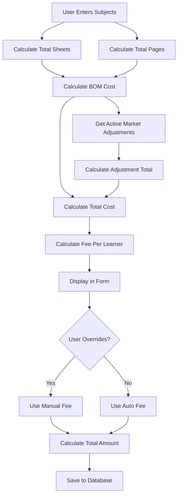

# Comprehensive Examination Module Redesign Plan

## Executive Summary

This document outlines a comprehensive implementation plan for redesigning the examination module to:

1. Remove existing Hidden BOM functionality and adjustments
2. Add Settings button to examination modal
3. Integrate Advanced Pricing Configuration (Hidden BOM, Active Market Adjustments) from inventory module
4. Implement automatic sheet/page calculations
5. Implement new cost calculation pipeline (BOM Cost + Adjustments)
6. Implement fee per learner calculation with manual override

---

## Current Architecture Analysis

### Existing Examination Module Components

| Component | Location | Purpose |
|-----------|----------|---------|
| [`ExaminationContext.tsx`](context/ExaminationContext.tsx:1) | `context/` | Frontend state management for examination data |
| [`ExaminationJobForm.tsx`](views/examination/ExaminationJobForm.tsx:1) | `views/examination/` | Main form for creating/editing examination jobs |
| [`BOMSelector.tsx`](views/examination/components/BOMSelector.tsx:1) | `views/examination/components/` | BOM selection component |
| [`ExaminationBatchModal.tsx`](views/examination/components/ExaminationBatchModal.tsx:1) | `views/examination/components/` | Modal for creating examination batches |
| [`examinationService.cjs`](server/services/examinationService.cjs:1) | `server/services/` | Backend service for BOM calculations |
| [`examHiddenBomService.ts`](services/examHiddenBomService.ts:1) | `services/` | Hidden BOM template management |

### Current Data Flow

```
User Input → ExaminationJobForm → Context → Backend Service
                ↓
         BOM Calculation (Hidden BOM)
                ↓
         Market Adjustments
                ↓
         Final Cost Calculation
```

---

## Phase 1: Remove Existing Hidden BOM Functionality

### 1.1 Backend Changes

#### Files to Modify:
- [`server/routes/examination.cjs`](server/routes/examination.cjs:1)
- [`server/services/examinationService.cjs`](server/services/examinationService.cjs:1)

#### Changes Required:

1. **Remove Hidden BOM initialization** from [`ExaminationContext.tsx`](context/ExaminationContext.tsx:116):
   ```typescript
   // REMOVE THIS:
   try {
     await initializeExamHiddenBOM();
   } catch (e) {
     console.warn('Could not initialize hidden Examination BOM:', e);
   }
   ```

2. **Remove BOM-related imports** from components:
   - Remove `EXAM_HIDDEN_BOM_TEMPLATE_ID` import from [`ExaminationJobForm.tsx`](views/examination/ExaminationJobForm.tsx:17)
   - Remove `initializeExamHiddenBOM` import from [`ExaminationContext.tsx`](context/ExaminationContext.tsx:22)

3. **Simplify calculation pipeline** in backend to remove automatic BOM calculations

### 1.2 Frontend Changes

#### Files to Modify:
- [`views/examination/ExaminationJobForm.tsx`](views/examination/ExaminationJobForm.tsx:1)
- [`views/examination/components/BOMSelector.tsx`](views/examination/components/BOMSelector.tsx:1)
- [`context/ExaminationContext.tsx`](context/ExaminationContext.tsx:1)

#### Changes Required:

1. **Remove hidden BOM detection logic** from BOMSelector
2. **Simplify form state** to remove BOM ID dependency (make it optional)
3. **Remove automatic BOM selection** logic

---

## Phase 2: Create Settings Button in Examination Modal

### 2.1 Add Settings Button to ExaminationJobForm

#### File: [`views/examination/ExaminationJobForm.tsx`](views/examination/ExaminationJobForm.tsx:1)

#### Implementation:

```tsx
// Add new state for settings panel
const [showSettings, setShowSettings] = useState(false);

// Add Settings button near the form header
<button
  type="button"
  onClick={() => setShowSettings(true)}
  className="flex items-center gap-2 px-3 py-2 text-sm font-medium text-slate-600 bg-slate-100 rounded-lg hover:bg-slate-200"
>
  <Settings className="w-4 h-4" />
  Settings
</button>
```

### 2.2 Create Settings Panel Component

#### New File: [`views/examination/components/ExaminationSettingsPanel.tsx`](views/examination/components/ExaminationSettingsPanel.tsx:1)

This panel will contain:
- Advanced Pricing Configuration section
- Active Market Adjustments section

---

## Phase 3: Integrate Advanced Pricing Configuration

### 3.1 Copy from Inventory Modal

Reference: [`views/inventory/components/ItemModal.tsx:1340-1491`](views/inventory/components/ItemModal.tsx:1340)

### 3.2 Required Components

#### 3.2.1 Hidden BOM (Automatic Cost) Section

Reference implementation from ItemModal:

```tsx
{/* Hidden BOM Section */}
<div className="bg-slate-50 p-4 rounded-lg border border-slate-200 mb-6">
  <h4 className="text-sm font-medium text-slate-700 mb-3">
    Hidden BOM (Automatic Cost Calculation)
  </h4>
  <div className="grid grid-cols-1 md:grid-cols-2 gap-4">
    {/* Paper Material Selection */}
    <div>
      <label className="block text-xs font-medium text-slate-600 mb-1">
        Paper Material
      </label>
      <select
        className="w-full px-3 py-2 border border-slate-200 rounded-lg text-sm"
        value={settingsConfig.paperId || ''}
        onChange={(e) => handlePricingConfigChange('paperId', e.target.value)}
      >
        <option value="">Select Paper...</option>
        {paperMaterials.map((m: Item) => (
          <option key={m.id} value={m.id}>
            {m.name} ({currency}{m.cost}/unit)
          </option>
        ))}
      </select>
    </div>
    
    {/* Toner Material Selection */}
    <div>
      <label className="block text-xs font-medium text-slate-600 mb-1">
        Toner Material
      </label>
      <select
        className="w-full px-3 py-2 border border-slate-200 rounded-lg text-sm"
        value={settingsConfig.tonerId || ''}
        onChange={(e) => handlePricingConfigChange('tonerId', e.target.value)}
      >
        <option value="">Select Toner...</option>
        {tonerMaterials.map((m: Item) => (
          <option key={m.id} value={m.id}>
            {m.name} ({currency}{m.cost}/unit)
          </option>
        ))}
      </select>
    </div>
  </div>
</div>
```

### 3.2.2 Data Structure for Settings

New interface to be added to [`types.ts`](types.ts:1):

```typescript
export interface ExaminationPricingConfig {
  paperId?: string;
  tonerId?: string;
  paperName?: string;
  tonerName?: string;
  finishingOptions: FinishingOption[];
  marketAdjustment?: number;
  marketAdjustmentId?: string;
  // Calculated values
  totalBOMCost?: number;
  totalAdjustment?: number;
  totalCost?: number;
}
```

### 3.3 State Management

Add to ExaminationContext:

```typescript
interface ExaminationContextType {
  // ... existing fields
  examPricingConfig: ExaminationPricingConfig;
  updateExamPricingConfig: (config: Partial<ExaminationPricingConfig>) => void;
}
```

---

## Phase 4: Integrate Active Market Adjustments

### 4.1 Copy from Inventory Modal

Reference: [`views/inventory/components/ItemModal.tsx:1434-1475`](views/inventory/components/ItemModal.tsx:1434)

### 4.2 Implementation

```tsx
{/* Market Adjustments */}
<div className="bg-indigo-50 p-4 rounded-lg border border-indigo-200">
  <div className="flex flex-col gap-4">
    <div>
      <h4 className="text-sm font-bold text-indigo-900">
        Active Market Adjustments
      </h4>
      <p className="text-xs text-indigo-600 mb-2">
        Automated system-wide pricing adjustments
      </p>
      
      <div className="flex flex-wrap gap-2">
        {(() => {
          const activeRules = marketAdjustments.filter(
            ma => ma.active ?? ma.isActive
          );
          if (activeRules.length > 0) {
            return activeRules.map(rule => (
              <div
                key={rule.id}
                className="px-3 py-1.5 border border-indigo-200 rounded-lg text-xs bg-indigo-100 text-indigo-900 font-medium flex items-center gap-2"
              >
                <Truck className="w-3 h-3" />
                {rule.name}
                <span className="bg-white px-1.5 py-0.5 rounded text-[10px] whitespace-nowrap">
                  {rule.type === 'PERCENTAGE' || rule.type === 'PERCENT'
                    ? `+${rule.value}%`
                    : `+${currency}${rule.value}`}
                </span>
              </div>
            ));
          }
          return (
            <span className="text-slate-500 italic text-sm">
              No active market adjustments found
            </span>
          );
        })()}
      </div>
    </div>
    
    <div className="flex items-center justify-between border-t border-indigo-100 pt-4">
      <span className="text-sm font-medium text-indigo-900">
        Total Adjustment Value
      </span>
      <div className="relative w-32">
        <span className="absolute left-3 top-1/2 -translate-y-1/2 text-indigo-500">
          {currency}
        </span>
        <input
          type="number"
          step="0.01"
          value={settingsConfig.marketAdjustment?.toFixed(2) || 0}
          readOnly
          className="w-full pl-8 pr-4 py-2 border border-indigo-200 rounded-lg text-indigo-900 bg-indigo-50 font-bold"
        />
      </div>
    </div>
  </div>
</div>
```

---

## Phase 5: Implement Automatic Calculations

### 5.1 Sheet Calculation

When subjects are entered, automatically calculate:

```
total_sheets = Σ ceil(subject.pages_per_paper × (1 + extra_copies) / 2) × number_of_learners
```

Constants:
- SHEETS_PER_REAM = 500
- PAGES_PER_SHEET = 2 (duplex printing)

### 5.2 Page Calculation

```
total_pages = Σ (subject.pages_per_paper × (1 + extra_copies)) × number_of_learners
```

### 5.3 Implementation in ExaminationJobForm

```typescript
// Calculate total sheets and pages when subjects change
const { totalSheets, totalPages } = useMemo(() => {
  if (!formData.subjects || formData.subjects.length === 0) {
    return { totalSheets: 0, totalPages: 0 };
  }
  
  let sheets = 0;
  let pages = 0;
  
  formData.subjects.forEach(subject => {
    const copies = 1 + (subject.extra_copies || 0);
    const subjectPages = subject.pages_per_paper * copies;
    const subjectSheets = Math.ceil(subjectPages / 2); // duplex
    
    pages += subjectPages * formData.number_of_learners;
    sheets += subjectSheets * formData.number_of_learners;
  });
  
  return { totalSheets: sheets, totalPages: pages };
}, [formData.subjects, formData.number_of_learners]);
```

---

## Phase 6: Cost Calculation Pipeline

### 6.1 Formula

```
Total BOM Cost = (paper_sheets × paper_unit_cost) + (toner_kg × toner_unit_cost)

Total Adjustments = Sum of all active market adjustments

Total Cost = Total BOM Cost + Total Adjustments
```

### 6.2 BOM Cost Calculation

```typescript
const calculateBOMCost = (
  paperId: string,
  tonerId: string,
  totalSheets: number,
  totalPages: number,
  inventory: Item[]
): number => {
  const paper = inventory.find(i => i.id === paperId);
  const toner = inventory.find(i => i.id === tonerId);
  
  // Paper: sheets needed (considering 500 sheets per ream)
  const paperCost = paper ? (totalSheets / 500) * paper.cost : 0;
  
  // Toner: 20 pages per gram
  const tonerKg = totalPages / 20000; // 20 pages per gram, 1000 grams per kg
  const tonerCost = toner ? tonerKg * toner.cost : 0;
  
  return paperCost + tonerCost;
};
```

### 6.3 Adjustment Calculation

```typescript
const calculateAdjustments = (
  marketAdjustments: MarketAdjustment[],
  bomCost: number
): number => {
  return marketAdjustments
    .filter(ma => ma.active ?? ma.isActive)
    .reduce((total, adj) => {
      if (adj.type === 'PERCENTAGE' || adj.type === 'PERCENT') {
        return total + (bomCost * (adj.value / 100));
      }
      return total + adj.value;
    }, 0);
};
```

### 6.4 Summary Display

```tsx
{/* Cost Summary */}
<div className="mt-4 p-4 bg-slate-800 rounded-lg text-white grid grid-cols-3 gap-4 text-center">
  <div>
    <div className="text-xs text-slate-400">Total BOM Cost</div>
    <div className="text-lg font-bold">{currency}{totalBOMCost.toFixed(2)}</div>
  </div>
  <div className="flex items-center justify-center text-slate-500">+</div>
  <div>
    <div className="text-xs text-slate-400">Total Adjustments</div>
    <div className="text-lg font-bold">{currency}{totalAdjustments.toFixed(2)}</div>
  </div>
</div>
```

---

## Phase 7: Fee Per Learner Calculation

### 7.1 Formula

```
Fee Per Learner = Total Cost / Number of Learners
```

### 7.2 Implementation

```typescript
// Calculate fee per learner
const feePerLearner = totalCost / (formData.number_of_learners || 1);

// Allow manual override
const [manualFeeEnabled, setManualFeeEnabled] = useState(false);
const [manualFee, setManualFee] = useState<number>(0);

const finalFeePerLearner = manualFeeEnabled ? manualFee : feePerLearner;
const totalAmount = finalFeePerLearner * formData.number_of_learners;
```

### 7.3 UI Component

```tsx
<div className="grid grid-cols-2 gap-4">
  {/* Auto-calculated fee */}
  <div className="p-4 bg-slate-50 rounded-lg">
    <label className="text-sm font-medium text-slate-700">
      Auto-calculated Fee per Learner
    </label>
    <div className="text-2xl font-bold text-slate-900">
      {currency}{feePerLearner.toFixed(2)}
    </div>
    <p className="text-xs text-slate-500 mt-1">
      Based on BOM cost + adjustments
    </p>
  </div>
  
  {/* Manual override */}
  <div className="p-4 bg-amber-50 rounded-lg border border-amber-200">
    <div className="flex items-center justify-between mb-2">
      <label className="text-sm font-medium text-amber-800">
        Override Fee
      </label>
      <input
        type="checkbox"
        checked={manualFeeEnabled}
        onChange={(e) => setManualFeeEnabled(e.target.checked)}
        className="rounded"
      />
    </div>
    {manualFeeEnabled && (
      <input
        type="number"
        step="0.01"
        value={manualFee}
        onChange={(e) => setManualFee(Number(e.target.value))}
        className="w-full px-3 py-2 border border-amber-300 rounded-lg"
        placeholder="Enter manual fee"
      />
    )}
    <div className="text-xl font-bold text-amber-900 mt-2">
      {currency}{finalFeePerLearner.toFixed(2)}
    </div>
  </div>
</div>

{/* Total Amount */}
<div className="mt-4 p-4 bg-blue-50 rounded-lg border border-blue-200">
  <div className="flex justify-between items-center">
    <span className="text-lg font-medium text-blue-900">Total Amount</span>
    <span className="text-2xl font-bold text-blue-900">
      {currency}{totalAmount.toFixed(2)}
    </span>
  </div>
</div>
```

---

## Phase 8: Backend Modifications

### 8.1 API Changes

#### New Endpoint: Calculate Examination Cost

```
POST /api/examination/calculate-cost
```

Request:
```json
{
  "paperId": "string",
  "tonerId": "string", 
  "totalSheets": "number",
  "totalPages": "number",
  "learnerCount": "number"
}
```

Response:
```json
{
  "bomCost": "number",
  "adjustments": "number",
  "totalCost": "number",
  "feePerLearner": "number"
}
```

### 8.2 Database Schema Changes

Add new fields to examination_jobs table:

```sql
ALTER TABLE examination_jobs 
ADD COLUMN pricing_config TEXT,  -- JSON for pricing configuration
ADD COLUMN total_sheets INTEGER,
ADD COLUMN total_pages INTEGER,
ADD COLUMN bom_cost REAL DEFAULT 0,
ADD COLUMN adjustment_cost REAL DEFAULT 0,
ADD COLUMN total_cost REAL DEFAULT 0,
ADD COLUMN fee_per_learner REAL,
ADD COLUMN fee_override_enabled BOOLEAN DEFAULT FALSE,
ADD COLUMN manual_fee_per_learner REAL;
```

---

## Phase 9: Testing & Build Verification

### 9.1 Build Verification

```bash
npm run build
```

Expected: Build succeeds without errors

### 9.2 Manual Testing Checklist

- [ ] Settings button opens configuration panel
- [ ] Paper and toner selection works
- [ ] Active market adjustments display correctly
- [ ] Total sheets calculates automatically
- [ ] Total pages calculates automatically
- [ ] BOM cost calculates correctly
- [ ] Adjustments apply correctly
- [ ] Total cost = BOM cost + adjustments
- [ ] Fee per learner auto-calculates
- [ ] Manual fee override works
- [ ] Total amount updates correctly
- [ ] Application builds without BOM-related errors

---

## File Modification Summary

### Files to Modify

| File | Changes |
|------|---------|
| [`context/ExaminationContext.tsx`](context/ExaminationContext.tsx:1) | Remove Hidden BOM init, add pricing config state |
| [`views/examination/ExaminationJobForm.tsx`](views/examination/ExaminationJobForm.tsx:1) | Add settings button, integrate pricing config |
| [`views/examination/components/BOMSelector.tsx`](views/examination/components/BOMSelector.tsx:1) | Simplify or remove BOM selection |
| [`types.ts`](types.ts:1) | Add ExaminationPricingConfig interface |
| [`server/routes/examination.cjs`](server/routes/examination.cjs:1) | Add cost calculation endpoint |
| [`server/db.cjs`](server/db.cjs:1) | Add new database fields |

### Files to Create

| File | Purpose |
|------|---------|
| [`views/examination/components/ExaminationSettingsPanel.tsx`](views/examination/components/ExaminationSettingsPanel.tsx:1) | Settings configuration panel |
| [`services/examPricingConfigService.ts`](services/examPricingConfigService.ts:1) | Pricing configuration service |

---

## Migration Strategy

1. **Step 1**: Create new Settings Panel component
2. **Step 2**: Add settings button to ExaminationJobForm
3. **Step 3**: Implement pricing configuration state
4. **Step 4**: Implement automatic calculations
5. **Step 5**: Implement cost pipeline
6. **Step 6**: Implement fee per learner calculation
7. **Step 7**: Add backend API endpoints
8. **Step 8**: Database migration
9. **Step 9**: Remove old BOM functionality
10. **Step 10**: Test and verify

---

## Data Flow Diagram



---

## Configuration Persistence

### Local Storage
- Store last used pricing configuration in localStorage
- Key: `examination_pricing_config`

### Database
- Persist configuration with each examination job
- Field: `pricing_config` (JSON)

---

## Implementation Priority

1. **High Priority**: Settings button + panel structure
2. **High Priority**: Automatic sheet/page calculations  
3. **High Priority**: BOM cost calculation
4. **Medium Priority**: Market adjustments integration
5. **Medium Priority**: Fee per learner calculation
6. **Low Priority**: Manual override functionality
7. **Low Priority**: Persistence layer
