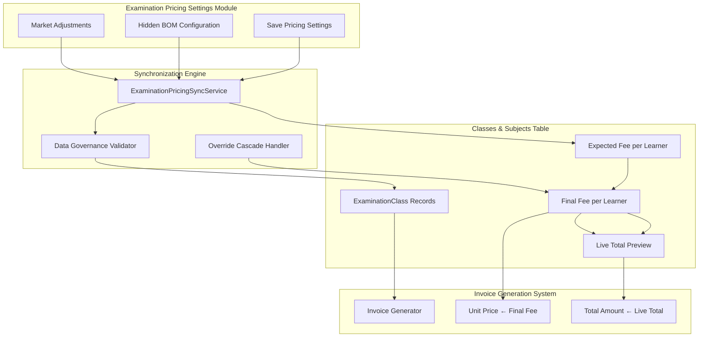
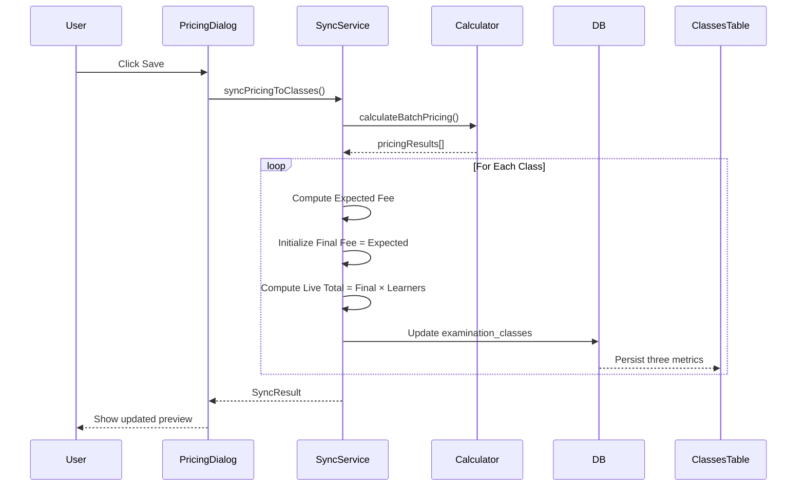

# Examination Pricing Redesign Architecture
## Comprehensive Bidirectional Data Consistency & Real-Time Financial Synchronization

---

## 1. Executive Summary

This document outlines a comprehensive redesign of the Examination Pricing system to ensure:
- **Bidirectional Data Consistency**: Changes in Examination Pricing Settings automatically propagate to Classes and Subjects table
- **Real-time Financial Synchronization**: Immediate cascade of override values to update dependent calculations
- **Strict Data Governance**: Only authorized fields propagate to invoice generation
- **Per-Class Financial Segmentation**: Granular cost tracking and reporting per individual class

---

## 2. Current Architecture Analysis

### 2.1 Existing Schema (ExaminationClass)
```typescript
interface ExaminationClass {
  id: string;
  batch_id: string;
  class_name: string;
  number_of_learners: number;
  suggested_cost_per_learner?: number;     // Expected fee (calculated)
  manual_cost_per_learner?: number | null;   // Override amount
  is_manual_override?: number | boolean;   // Override flag
  manual_override_reason?: string | null;
  manual_override_by?: string | null;
  manual_override_at?: string | null;
  calculated_total_cost?: number;          // Total cost
  material_total_cost?: number;
  adjustment_total_cost?: number;
  adjustment_delta_percent?: number;
  cost_last_calculated_at?: string;
  calculated_total_pages?: number;
  calculated_total_sheets?: number;
  price_per_learner?: number;              // Final fee (suggested or manual)
  total_price?: number;                    // Total price
  currency?: string;
  total_amount?: number;
  created_at: string;
  updated_at?: string;
  subjects?: ExaminationSubject[];
}
```

### 2.2 Current Flow Issues
1. **No explicit expected_fee_per_learner field** - uses `suggested_cost_per_learner`
2. **No live_total_preview field** - calculated on-the-fly in UI
3. **No automatic propagation** from Pricing Settings to Classes table on save
4. **Override cascade is manual** - requires Apply button click
5. **Invoice generation uses mixed fields** - not strictly governed

---

## 3. Proposed Architecture

### 3.1 Enhanced Schema (ExaminationClass)
```typescript
interface ExaminationClass {
  // ... existing fields ...
  
  // NEW: Three Critical Financial Metrics
  expected_fee_per_learner: number;        // Mirroring Pricing Settings calculation exactly
  final_fee_per_learner: number;           // Mutable, initialized = expected_fee_per_learner
  live_total_preview: number;              // Final Fee × Learner Count (real-time)
  
  // Metadata for audit trail
  financial_metrics_updated_at?: string;
  financial_metrics_updated_by?: string;
  financial_metrics_source?: 'SYSTEM_CALCULATION' | 'MANUAL_OVERRIDE' | 'PRICING_SETTINGS_SYNC';
}
```

### 3.2 System Architecture Diagram



---

## 4. Detailed Implementation Plan

### 4.1 Database Schema Updates

#### 4.1.1 New Columns for examination_classes Table
```sql
-- Add three critical financial metrics
ALTER TABLE examination_classes ADD COLUMN expected_fee_per_learner REAL DEFAULT 0;
ALTER TABLE examination_classes ADD COLUMN final_fee_per_learner REAL DEFAULT 0;
ALTER TABLE examination_classes ADD COLUMN live_total_preview REAL DEFAULT 0;

-- Add metadata columns for audit trail
ALTER TABLE examination_classes ADD COLUMN financial_metrics_updated_at DATETIME;
ALTER TABLE examination_classes ADD COLUMN financial_metrics_updated_by TEXT;
ALTER TABLE examination_classes ADD COLUMN financial_metrics_source TEXT;

-- Create indexes for performance
CREATE INDEX idx_exam_classes_expected_fee ON examination_classes(expected_fee_per_learner);
CREATE INDEX idx_exam_classes_final_fee ON examination_classes(final_fee_per_learner);
CREATE INDEX idx_exam_classes_live_total ON examination_classes(live_total_preview);
```

#### 4.1.2 Migration Strategy
```sql
-- Migrate existing data
UPDATE examination_classes SET
  expected_fee_per_learner = COALESCE(suggested_cost_per_learner, price_per_learner, 0),
  final_fee_per_learner = COALESCE(price_per_learner, suggested_cost_per_learner, 0),
  live_total_preview = COALESCE(total_price, calculated_total_cost, price_per_learner * number_of_learners, 0),
  financial_metrics_updated_at = CURRENT_TIMESTAMP,
  financial_metrics_source = 'SYSTEM_CALCULATION'
WHERE expected_fee_per_learner IS NULL OR expected_fee_per_learner = 0;
```

### 4.2 Bidirectional Data Consistency Service

#### 4.2.1 ExaminationPricingSyncService
```typescript
// services/examinationPricingSyncService.ts

export interface SyncResult {
  success: boolean;
  batchId: string;
  classesUpdated: number;
  errors: Array<{ classId: string; error: string }>;
  timestamp: string;
}

export interface PricingSyncPayload {
  batchId: string;
  settings: PricingSettings;
  adjustments: MarketAdjustment[];
  triggeredBy: string;
  triggerSource: 'PRICING_SETTINGS_SAVE' | 'MANUAL_RECALCULATION' | 'OVERRIDE_CHANGE';
}

export class ExaminationPricingSyncService {
  /**
   * Main synchronization method - called when Pricing Settings are saved
   * Automatically populates Classes table with three financial metrics
   */
  async syncPricingToClasses(payload: PricingSyncPayload): Promise<SyncResult>;
  
  /**
   * Real-time override cascade - updates Final Fee and Live Total
   */
  async applyOverrideCascade(
    classId: string, 
    overrideAmount: number,
    userId: string
  ): Promise<{ finalFee: number; liveTotal: number }>;
  
  /**
   * Validate data governance rules before persistence
   */
  validateForInvoiceGeneration(batchId: string): Promise<boolean>;
}
```

#### 4.2.2 Sync Flow on Pricing Settings Save


### 4.3 Dynamic Override Functionality

#### 4.3.1 Override Input Cascade Logic
```typescript
// utils/overrideCascadeEngine.ts

export interface OverrideCascadeResult {
  classId: string;
  previousFinalFee: number;
  newFinalFee: number;
  previousLiveTotal: number;
  newLiveTotal: number;
  learnerCount: number;
  updatedAt: string;
}

/**
 * Real-time override cascade handler
 * Triggered immediately when user inputs override amount
 */
export function handleOverrideCascade(
  classData: ExaminationClass,
  overrideAmount: number,
  userId: string
): OverrideCascadeResult {
  const previousFinalFee = classData.final_fee_per_learner;
  const newFinalFee = overrideAmount;
  const learnerCount = classData.number_of_learners;
  
  // Immediate recalculation of Live Total Preview
  const newLiveTotal = roundMoney(newFinalFee * learnerCount);
  
  return {
    classId: classData.id,
    previousFinalFee,
    newFinalFee,
    previousLiveTotal: classData.live_total_preview,
    newLiveTotal,
    learnerCount,
    updatedAt: new Date().toISOString()
  };
}
```

#### 4.3.2 UI Implementation
```typescript
// In ExaminationBatchDetail.tsx - Real-time handler

const handleOverrideInputChange = (classId: string, value: string) => {
  const overrideAmount = parseFloat(value);
  if (isNaN(overrideAmount) || overrideAmount < 0) return;
  
  // Immediate local state update for responsiveness
  setPricingDrafts((prev) => ({ ...prev, [classId]: value }));
  
  // Cascade to update Final Fee and Live Total
  const cls = batch?.classes?.find(c => c.id === classId);
  if (cls) {
    const cascadeResult = handleOverrideCascade(cls, overrideAmount, currentUser.id);
    
    // Update class with new values
    updateClassFinancialMetrics(classId, {
      final_fee_per_learner: cascadeResult.newFinalFee,
      live_total_preview: cascadeResult.newLiveTotal,
      financial_metrics_source: 'MANUAL_OVERRIDE',
      financial_metrics_updated_by: currentUser.id,
      financial_metrics_updated_at: cascadeResult.updatedAt
    });
  }
};
```

### 4.4 Data Governance Protocol

#### 4.4.1 Strict Field Validation for Invoice Generation
```typescript
// services/invoiceDataGovernanceService.ts

export interface InvoiceGenerationPayload {
  batchId: string;
  lineItems: Array<{
    classId: string;
    className: string;
    // ONLY these two fields are allowed for invoice
    unitPrice: number;  // ← Must be final_fee_per_learner
    totalAmount: number;  // ← Must be live_total_preview
    learners: number;
  }>;
}

/**
 * Enforces strict data governance - only Final Fee and Live Total allowed
 */
export function validateInvoicePayload(
  batch: ExaminationBatch
): InvoiceGenerationPayload {
  const lineItems = (batch.classes || []).map(cls => {
    // STRICT ENFORCEMENT: Only use final_fee_per_learner and live_total_preview
    const unitPrice = cls.final_fee_per_learner;
    const totalAmount = cls.live_total_preview;
    
    // Validation: Ensure these fields are populated
    if (unitPrice === undefined || unitPrice === null) {
      throw new Error(`Class ${cls.class_name}: final_fee_per_learner is not populated`);
    }
    if (totalAmount === undefined || totalAmount === null) {
      throw new Error(`Class ${cls.class_name}: live_total_preview is not populated`);
    }
    
    return {
      classId: cls.id,
      className: cls.class_name,
      unitPrice,
      totalAmount,
      learners: cls.number_of_learners
    };
  });
  
  return { batchId: batch.id, lineItems };
}
```

#### 4.4.2 Field Usage Matrix
| Field | Display in UI | Invoice Generation | Editable |
|-------|--------------|-------------------|----------|
| `expected_fee_per_learner` | Yes (read-only) | No | No |
| `final_fee_per_learner` | Yes | **Yes (Unit Price)** | Yes (via Override) |
| `live_total_preview` | Yes | **Yes (Total Amount)** | No (auto-calculated) |

### 4.5 Updated Calculation Engine

#### 4.5.1 Enhanced Batch Pricing Calculator
```typescript
// utils/examinationPricingCalculator.ts

export interface EnhancedClassPricingResult {
  classId: string;
  className: string;
  learners: number;
  totalSheets: number;
  totalPages: number;
  totalBomCost: number;
  totalAdjustments: number;
  totalCost: number;
  
  // THREE CRITICAL METRICS
  expectedFeePerLearner: number;     // Exact mirror of Pricing Settings calc
  finalFeePerLearner: number;        // Mutable, starts = expected
  liveTotalPreview: number;         // Final Fee × Learners
}

export const calculateEnhancedBatchPricing = (
  batch: ExaminationBatch,
  settings: PricingSettings,
  activeAdjustments: MarketAdjustment[]
): { classes: EnhancedClassPricingResult[] } => {
  
  const classes = (batch.classes || []).map(cls => {
    // ... existing BOM calculations ...
    
    const expectedFeePerLearner = calculateExpectedFee(cls, settings, activeAdjustments);
    
    // Initialize final fee to match expected (can be overridden later)
    const finalFeePerLearner = cls.final_fee_per_learner || expectedFeePerLearner;
    
    // Calculate live total based on current final fee
    const liveTotalPreview = roundMoney(finalFeePerLearner * cls.number_of_learners);
    
    return {
      classId: cls.id,
      className: cls.class_name,
      learners: cls.number_of_learners,
      totalSheets,
      totalPages,
      totalBomCost,
      totalAdjustments,
      totalCost,
      expectedFeePerLearner,
      finalFeePerLearner,
      liveTotalPreview
    };
  });
  
  return { classes };
};
```

---

## 5. Implementation Steps

### Step 1: Database Schema Updates
- Add `expected_fee_per_learner`, `final_fee_per_learner`, `live_total_preview` columns
- Add metadata columns for audit trail
- Create migration script for existing data

### Step 2: Create ExaminationPricingSyncService
- Implement `syncPricingToClasses()` method
- Implement `applyOverrideCascade()` method
- Add data governance validation

### Step 3: Update ExaminationPricingSettingsDialog
- On save, call sync service to populate classes
- Add loading state for synchronization
- Display sync results summary

### Step 4: Modify ExaminationBatchDetail
- Replace current pricing display with three metrics
- Implement real-time override input handler
- Add cascade logic for immediate Live Total update

### Step 5: Update Backend examinationService.cjs
- Modify `calculateBatch()` to persist three metrics
- Ensure invoice generation uses only Final Fee and Live Total

### Step 6: Update TypeScript Types
- Add new fields to `ExaminationClass` interface
- Create new types for sync results and cascade operations

### Step 7: Testing & Validation
- Verify bidirectional consistency
- Test real-time override cascade
- Validate invoice generation uses correct fields

---

## 6. Key Technical Decisions

### 6.1 Real-time vs. Debounced Updates
- **Override Input**: Immediate cascade (real-time)
- **Pricing Settings Save**: Batch sync on save action
- **Backend Persistence**: Debounced 500ms to prevent spam

### 6.2 Data Governance Enforcement
- Runtime validation before invoice generation
- TypeScript compile-time enforcement via strict interfaces
- Database constraints (NOT NULL for critical fields)

### 6.3 Audit Trail
- Track every change to financial metrics
- Store source of change (SYSTEM_CALCULATION, MANUAL_OVERRIDE, PRICING_SETTINGS_SYNC)
- Store user who made the change

---

## 7. Success Criteria

1. ✅ **Bidirectional Consistency**: Pricing Settings save automatically updates all class records
2. ✅ **Real-time Cascade**: Override input immediately updates Final Fee and Live Total
3. ✅ **Strict Data Governance**: Only `final_fee_per_learner` and `live_total_preview` flow to invoices
4. ✅ **Per-Class Granularity**: Each class has independent financial tracking
5. ✅ **Audit Trail**: Complete history of financial metric changes
6. ✅ **Backward Compatibility**: Existing batches continue to work

---

## 8. Risk Mitigation

| Risk | Mitigation Strategy |
|------|---------------------|
| Data inconsistency during migration | Transactional updates with rollback capability |
| Performance impact of real-time calc | Debounced persistence + optimistic UI updates |
| Invoice generation with null values | Strict validation throwing errors before invoice creation |
| User confusion with three metrics | Clear UI labeling with tooltips explaining each field |

---

## 9. Files to Modify

### Database
- `server/db.cjs` - Add new columns
- `server/migrations/` - Create migration script

### Backend
- `server/services/examinationService.cjs` - Update calculation and persistence
- `server/routes/examination.cjs` - Add sync endpoints

### Frontend Services
- `services/examinationPricingSyncService.ts` - NEW FILE
- `services/invoiceDataGovernanceService.ts` - NEW FILE
- `services/examinationBatchService.ts` - Add sync methods

### Frontend Utils
- `utils/examinationPricingCalculator.ts` - Add enhanced calculation
- `utils/overrideCascadeEngine.ts` - NEW FILE

### Frontend Components
- `views/examination/ExaminationBatchDetail.tsx` - Update display and handlers
- `views/examination/components/ExaminationPricingSettingsDialog.tsx` - Add save-to-classes

### Types
- `types.ts` - Add new fields to ExaminationClass

---

*Document Version: 1.0*
*Created: 2026-02-28*
*Status: Architecture Complete - Ready for Implementation*
