# Variant Adjustment Bug Fix Plan

## Problem Statement

When selecting a product variant in POS or the invoice process (quotation → order → invoice), the system displays the parent product's adjustments instead of the variant-specific adjustments. Additionally, variant adjustments are not being tracked in margin performance reports.

## Root Cause Analysis

### Issue 1: POS ProductGrid.tsx - Missing Variant AdjustmentSnapshots

**Location:** [`views/pos/components/ProductGrid.tsx`](views/pos/components/ProductGrid.tsx:56-75)

```typescript
const handleVariantSelect = (variant: ProductVariant) => {
    const variantItem: any = {
        ...selectedProductForVariants,
        id: variant.id,
        parentId: selectedProductForVariants.id,
        sku: variant.sku,
        name: variant.name,
        price: variant.price,
        cost: variant.cost,
        stock: variant.stock,
        isVariantParent: false,
        variants: []
        // ❌ MISSING: adjustmentSnapshots, adjustmentTotal, productionCostSnapshot
    };
    
    addToCart(variantItem);
};
```

**Problem:** The variant's `adjustmentSnapshots`, `adjustmentTotal`, and `productionCostSnapshot` are not being passed to the cart item.

### Issue 2: POS.tsx - Fallback Calculation Uses Parent Cost

**Location:** [`views/POS.tsx`](views/POS.tsx:176-196)

```typescript
// Calculate snapshots if missing (e.g. legacy items)
if (item.type !== 'Service' && (!adjustmentSnapshots || adjustmentSnapshots.length === 0)) {
    const activeAdjs = marketAdjustments.filter((ma: any) => ma.active ?? ma.isActive);
    const itemCost = item.cost || 0;  // Uses variant cost - this is correct
    adjustmentSnapshots = activeAdjs.map((adj: any) => {
        // ... calculation based on itemCost
    });
}
```

**Problem:** The fallback calculation is correct, but it only triggers when `adjustmentSnapshots` is empty. Since variants should have their own snapshots, the fallback shouldn't be needed if Issue 1 is fixed.

### Issue 3: Invoice Process - OrderForm.tsx handleVariantSelect

**Location:** [`views/sales/components/OrderForm.tsx`](views/sales/components/OrderForm.tsx:478-531)

The `handleVariantSelect` function correctly calls `getInventoryPrices()` which returns `adjustmentSnapshots` for dynamic pricing variants. However, the function needs to ensure:

1. Variant `pagesOverride` is properly set
2. `productionCostSnapshot` is included
3. The variant's `pricingSource` is tracked for future recalculation

### Issue 4: Quotation → Order Conversion Loses Adjustment Data

**Location:** [`context/OrdersContext.tsx`](context/OrdersContext.tsx:38-90)

```typescript
const handleConvertQuotationToOrder = async (quotation: Quotation): Promise<string> => {
    const mappedItems = quotation.items.map(item => {
        return {
            id: generateNextId('OI'),
            orderId: '',
            productId: item.id || (item as any).productId || 'N/A',
            productName: item.name || (item as any).productName || 'N/A',
            quantity,
            unitPrice,
            subtotal: unitPrice * quantity,
            discount: (item as any).discount || 0
            // ❌ MISSING: adjustmentSnapshots, productionCostSnapshot, parentId, pagesOverride
        };
    });
    // ...
};
```

**Problem:** When converting a quotation to an order, the variant adjustment data is lost because the mapping doesn't preserve `adjustmentSnapshots`, `productionCostSnapshot`, `parentId`, or `pagesOverride`.

### Issue 5: Quotation → Invoice Conversion Loses Adjustment Data

**Location:** [`context/SalesContext.tsx`](context/SalesContext.tsx:347-378)

```typescript
const convertQuotationToInvoice = async (q: Quotation): Promise<string> => {
    const invoice: Invoice = {
        // ...
        items: q.items.map(item => ({
            ...item,
            lineTotalNet: item.lineTotalNet || (item.price * item.quantity)
            // ⚠️ SPREAD OPERATOR: Preserves adjustmentSnapshots if present
            // but doesn't recalculate for dynamic pricing
        })),
        // ...
    };
};
```

**Problem:** While the spread operator preserves existing `adjustmentSnapshots`, the conversion doesn't recalculate adjustments for dynamic pricing variants if the pages have changed.

### Issue 6: Margin Reports - Variant Adjustment Tracking

**Location:** [`views/POS.tsx`](views/POS.tsx:341-377)

The `handleCompletePayment` function correctly includes `adjustmentSnapshots` in sale items, but the issue is upstream - variant snapshots aren't being passed through the cart.

---

## Data Flow Diagram

```mermaid
flowchart TD
    subgraph POS_Flow[POS Flow]
        A[Variant Selected in ProductGrid] --> B[handleVariantSelect]
        B --> C{Has adjustmentSnapshots?}
        C -->|Yes - Pass through| D[addToCart in POS.tsx]
        C -->|No - Missing| E[Fallback Calculation]
        E --> F[Uses variant.cost - Correct]
        D --> G[Cart Item with Snapshots]
        F --> G
        G --> H[cartAdjustmentSummary]
        H --> I[Totals Section Display]
        G --> J[handleCompletePayment]
        J --> K[Sale Record]
        K --> L[Margin Performance Reports]
    end

    subgraph Invoice_Flow[Invoice Process Flow]
        M[Quotation Created] --> N[OrderForm handleVariantSelect]
        N --> O[Quotation Saved with adjustmentSnapshots]
        O --> P{Convert to Order?}
        P -->|Yes| Q[handleConvertQuotationToOrder]
        Q --> R[Order Items - MUST preserve adjustments]
        O --> S{Convert to Invoice?}
        S -->|Yes| T[convertQuotationToInvoice]
        T --> U[Invoice Items - MUST preserve adjustments]
        R --> V[Order to Invoice]
        V --> U
        U --> W[Margin Reports]
    end
```



---

## Implementation Plan

### Phase 1: Fix POS ProductGrid Variant Selection

**File:** [`views/pos/components/ProductGrid.tsx`](views/pos/components/ProductGrid.tsx)

**Change:** Update `handleVariantSelect` to include variant adjustment data:

```typescript
const handleVariantSelect = (variant: ProductVariant) => {
    if (!selectedProductForVariants) return;
    
    // Convert variant to Item with parentId for stock reservation
    const variantItem: any = {
        ...selectedProductForVariants,
        id: variant.id,
        parentId: selectedProductForVariants.id,
        sku: variant.sku,
        name: variant.name,
        price: variant.price,
        cost: variant.cost,
        stock: variant.stock,
        isVariantParent: false,
        variants: [],
        // ✅ ADD: Variant-specific adjustment data
        adjustmentSnapshots: variant.adjustmentSnapshots || [],
        adjustmentTotal: variant.adjustmentTotal || 0,
        productionCostSnapshot: variant.productionCostSnapshot,
        pagesOverride: variant.pages,  // For dynamic pricing reference
        pricingSource: variant.pricingSource  // Track pricing mode
    };
    
    addToCart(variantItem);
    setSelectedProductForVariants(null);
};
```

### Phase 2: Update POS VariantSelectorModal to Pass Adjustments

**File:** [`views/pos/components/PosModals.tsx`](views/pos/components/PosModals.tsx)

**Change:** Ensure `VariantSelectorModal` passes variant adjustment data:

1. Check if variant has `adjustmentSnapshots` from inventory
2. If variant uses dynamic pricing, calculate adjustments on selection
3. Pass complete adjustment data to `onSelect` callback

### Phase 3: Update POS addToCart for Dynamic Variant Pricing

**File:** [`views/POS.tsx`](views/POS.tsx)

**Change:** Enhance `addToCart` to handle variant adjustments:

```typescript
const addToCart = async (item: any) => {
    // ... existing stock reservation code ...

    let price = item.price;
    let adjustmentTotal = item.adjustmentTotal || 0;
    let adjustmentBreakdown = item.adjustmentBreakdown || [];
    let adjustmentSnapshots = item.adjustmentSnapshots || [];
    let productionCostSnapshot = item.productionCostSnapshot;

    // ✅ NEW: For variants with dynamic pricing, recalculate if needed
    if (item.parentId && item.pricingSource === 'dynamic') {
        const parentItem = inventory.find((i: Item) => i.id === item.parentId);
        if (parentItem) {
            const result = pricingService.calculateVariantPrice(
                parentItem,
                { ...item, pages: item.pagesOverride || item.pages },
                item.quantity || 1,
                inventory,
                bomTemplates,  // Get from context
                marketAdjustments
            );
            price = result.price;
            adjustmentTotal = result.adjustmentTotal;
            adjustmentSnapshots = result.adjustmentSnapshots;
            productionCostSnapshot = result.consumption ? {
                baseProductionCost: result.cost,
                components: result.consumption.bomBreakdown?.map(b => ({
                    componentId: b.materialId,
                    name: b.materialName,
                    quantity: b.quantity,
                    unit: b.unit,
                    unitCost: b.cost,
                    totalCost: b.quantity * b.cost,
                    costRole: 'production' as const
                })) || [],
                totalPagesUsed: item.pagesOverride || item.pages,
                source: 'VARIANT_PRICING' as const,
                createdAt: new Date().toISOString()
            } : undefined;
        }
    }

    // ... rest of addToCart logic ...
};
```

### Phase 4: Fix OrderForm Variant Selection for Invoice Process

**File:** [`views/sales/components/OrderForm.tsx`](views/sales/components/OrderForm.tsx:478-531)

**Change:** Update `handleVariantSelect` to include all variant adjustment data:

```typescript
const handleVariantSelect = async (variant: ProductVariant) => {
    if (!selectedProductForVariants) return;

    // Check if this specific variant already exists
    const existingItemIdx = formData.items.findIndex((i: any) => i.id === variant.id && i.parentId === selectedProductForVariants.id);

    if (existingItemIdx > -1) {
        // Variant exists, just increment quantity
        await handleQuantityChange(existingItemIdx, formData.items[existingItemIdx].quantity + 1);
        notify(`Incremented quantity for ${variant.name}`, "success");
    } else {
        // Variant Item Setup with complete adjustment data
        const variantItem: any = {
            ...selectedProductForVariants,
            id: variant.id,
            parentId: selectedProductForVariants.id,
            sku: variant.sku,
            name: variant.name,
            price: variant.price,
            cost: variant.cost,
            stock: variant.stock,
            isVariantParent: false,
            variants: [],
            // ✅ ADD: Complete variant adjustment data
            pagesOverride: variant.pages,
            pricingSource: variant.pricingSource,
            adjustmentSnapshots: variant.adjustmentSnapshots || [],
            adjustmentTotal: variant.adjustmentTotal || 0,
            productionCostSnapshot: variant.productionCostSnapshot
        };

        // Add atomic stock reservation for variant
        updateReservedStock(selectedProductForVariants.id, 1, `Variant selection in ${type} Form`, variant.id);

        // Use dynamic pricing if configured
        const prices = getInventoryPrices(variantItem as CartItem);
        variantItem.price = Number(prices.price) || 0;
        variantItem.cost = Number(prices.cost) || 0;
        variantItem.basePrice = Number(prices.cost) || 0;
        // ✅ IMPORTANT: Use calculated adjustmentSnapshots from getInventoryPrices
        variantItem.adjustmentSnapshots = prices.adjustmentSnapshots;

        setFormData((prev: any) => ({
            ...prev,
            items: [...prev.items, variantItem]
        }));

        notify(`${variant.name} added`, "success");
    }

    setSelectedProductForVariants(null);
    setItemSearch('');
};
```

### Phase 5: Fix Quotation → Order Conversion

**File:** [`context/OrdersContext.tsx`](context/OrdersContext.tsx:38-90)

**Change:** Update `handleConvertQuotationToOrder` to preserve variant adjustment data:

```typescript
const handleConvertQuotationToOrder = async (quotation: Quotation): Promise<string> => {
    try {
        const orderNumber = `ORD-${new Date().toISOString().slice(0, 10).replace(/-/g, '')}-${Math.floor(Math.random() * 1000).toString().padStart(3, '0')}`;

        const mappedItems = quotation.items.map(item => {
            const unitPrice = toNum((item as any).price || (item as any).unitPrice || (item as any).cost);
            const quantity = toNum((item as any).quantity || (item as any).qty, 0);
            return {
                id: generateNextId('OI'),
                orderId: '',
                productId: item.id || (item as any).productId || 'N/A',
                productName: item.name || (item as any).productName || (item as any).description || 'N/A',
                quantity,
                unitPrice,
                subtotal: unitPrice * quantity,
                discount: (item as any).discount || 0,
                // ✅ ADD: Preserve variant adjustment data
                parentId: (item as any).parentId,
                pagesOverride: (item as any).pagesOverride,
                pricingSource: (item as any).pricingSource,
                adjustmentSnapshots: (item as any).adjustmentSnapshots || [],
                productionCostSnapshot: (item as any).productionCostSnapshot
            };
        });

        // ... rest of the function
    }
};
```

### Phase 6: Fix Quotation → Invoice Conversion

**File:** [`context/SalesContext.tsx`](context/SalesContext.tsx:347-378)

**Change:** Update `convertQuotationToInvoice` to preserve and aggregate adjustment data:

```typescript
const convertQuotationToInvoice = async (q: Quotation): Promise<string> => {
    const invId = generateNextId('invoice', finance.invoices, companyConfig);

    // ✅ Aggregate adjustment snapshots from all items
    const allAdjustmentSnapshots: any[] = [];
    let totalAdjustment = 0;

    const invoiceItems = q.items.map(item => {
        // Preserve item-level adjustment snapshots
        const itemSnapshots = (item as any).adjustmentSnapshots || [];
        itemSnapshots.forEach((snap: any) => {
            const existing = allAdjustmentSnapshots.find(s => s.name === snap.name);
            if (existing) {
                existing.calculatedAmount += snap.calculatedAmount || 0;
            } else {
                allAdjustmentSnapshots.push({ ...snap });
            }
            totalAdjustment += snap.calculatedAmount || 0;
        });

        return {
            ...item,
            lineTotalNet: item.lineTotalNet || (item.price * item.quantity)
            // adjustmentSnapshots preserved via spread operator
        };
    });

    const invoice: Invoice = {
        id: invId,
        customerName: q.customerName,
        totalAmount: q.total,
        paidAmount: 0,
        date: new Date().toISOString(),
        dueDate: q.validUntil || new Date().toISOString(),
        status: 'Unpaid',
        items: invoiceItems,
        // ✅ ADD: Aggregate adjustment data at invoice level
        adjustmentSnapshots: allAdjustmentSnapshots,
        adjustmentTotal: totalAdjustment,
        notes: `Converted from [Quotation] #[${q.id}] on [${new Date().toLocaleDateString()}] as accepted by [${q.customerName}]`
    };

    // ... rest of the function
};
```

### Phase 7: Ensure Margin Report Tracking

**File:** [`services/transactionService.ts`](services/transactionService.ts)

**Verify:** The `processSale` function correctly stores variant adjustment data:

1. Check that `adjustmentSnapshots` are stored per sale item
2. Verify `productionCostSnapshot` includes variant-specific data
3. Ensure margin calculations use variant adjustments

---

## Testing Checklist

### Unit Tests
- [ ] POS variant selection passes adjustmentSnapshots to cart
- [ ] POS cart adjustmentSummary correctly aggregates variant adjustments
- [ ] Dynamic pricing recalculates adjustments for variants
- [ ] OrderForm variant selection includes adjustmentSnapshots
- [ ] Quotation → Order conversion preserves adjustment data
- [ ] Quotation → Invoice conversion preserves adjustment data

### Integration Tests
- [ ] POS totals section shows variant adjustments
- [ ] Sale record includes variant adjustmentSnapshots
- [ ] Margin reports reflect variant-specific margins
- [ ] Quotation displays variant adjustments correctly
- [ ] Order from quotation shows variant adjustments
- [ ] Invoice from quotation/order shows variant adjustments

### Manual Testing
1. Create a parent product with Hidden BOM
2. Add variants with different page counts
3. **POS Flow:**
   - Select variant in POS
   - Verify totals section shows variant adjustments
   - Complete sale
   - Check margin report includes variant data
4. **Invoice Flow:**
   - Create quotation with variant
   - Verify quotation shows variant adjustments
   - Convert to order - verify adjustments preserved
   - Convert to invoice - verify adjustments preserved
   - Check margin report includes variant data

---

## Files to Modify

| File | Changes |
|------|---------|
| `views/pos/components/ProductGrid.tsx` | Pass variant adjustmentSnapshots to cart |
| `views/pos/components/PosModals.tsx` | Ensure VariantSelectorModal passes adjustments |
| `views/POS.tsx` | Handle dynamic variant pricing in addToCart |
| `views/sales/components/OrderForm.tsx` | Include adjustmentSnapshots in handleVariantSelect |
| `context/OrdersContext.tsx` | Preserve adjustment data in handleConvertQuotationToOrder |
| `context/SalesContext.tsx` | Preserve and aggregate adjustments in convertQuotationToInvoice |
| `services/transactionService.ts` | Verify variant adjustment storage |

---

## Risk Assessment

| Risk | Impact | Mitigation |
|------|--------|------------|
| Performance impact from recalculating | Low | Only recalculate for dynamic pricing variants |
| Backward compatibility | Medium | Fallback to existing logic for static variants |
| Data consistency | Low | Variant snapshots stored at sale time |
