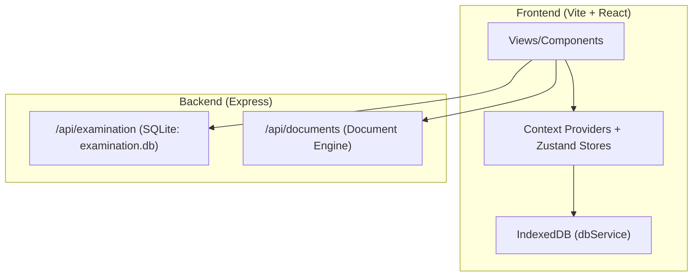
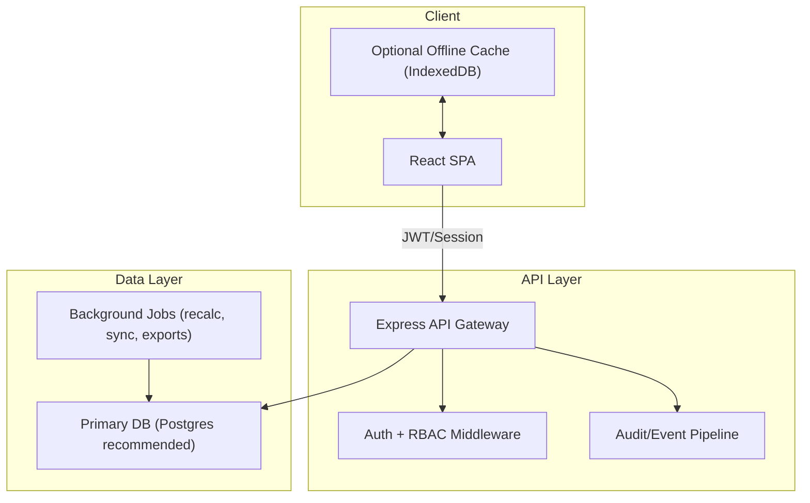
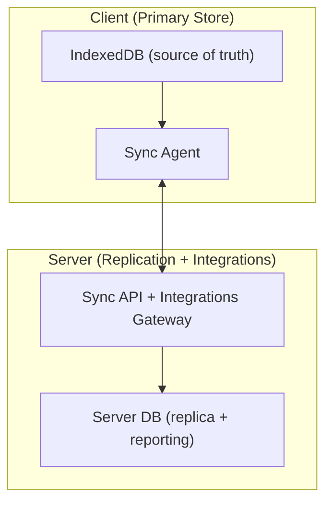

# Prime ERP System — Production Readiness Roadmap (Phased Execution Plan)

## Executive Summary

Prime ERP is currently a hybrid offline-first SPA (IndexedDB) with a Node/Express backend used primarily for the Examination module and a Document Engine. For production readiness (multi-user, auditable, secure, maintainable, integrable), the system needs server-enforced authentication/authorization, a centralized data layer (or a formal offline sync protocol), compliance-grade audit trails, and operational observability.

This document converts the analysis into a phased delivery plan with epics, technical requirements, estimates, dependencies, success criteria, and file-level impact mapping.

## Current-State Architecture

**Key characteristics**
- Most ERP domains run locally via IndexedDB (sales/inventory/ledger/procurement) and client-side role checks.
- The backend provides real APIs for Examination calculations and document workflows.
- Authentication is effectively bypassed through auto-login.

## Target-State Architecture (Production-Ready)

Two viable deployment targets exist. Pick one as the official v1 production posture.

### Option A — Centralized Server of Record (Recommended for multi-user)

### Option B — Offline-First with Formal Sync (Single-site + occasional connectivity)

## Phased Plan (Milestones)

### Phase 0 — Stabilize & Make Work Observable (2–3 weeks)
- Establish baseline metrics, error reporting, and operational dashboards.
- Standardize error handling and logging contracts for frontend and backend.
- Add “production mode” switches and remove debug-only behaviors.

### Phase 1 — Security Foundation (4–6 weeks)
- Replace auto-login with real authentication.
- Move RBAC enforcement to server middleware (not only client routes).
- Implement session/JWT management and credential hardening.

### Phase 2 — Data Architecture Decision + Implementation (8–12 weeks)
- Choose Option A (central server) or Option B (offline sync).
- Implement core domain APIs and migrate the highest-risk workflows first (Sales → Inventory → Ledger).
- Establish schema migrations and data validation at boundaries.

### Phase 3 — Compliance, Auditability, and DR (4–6 weeks)
- Tamper-evident audit log pipeline, field-level history for sensitive entities.
- Encrypted backups with restore drills and defined RPO/RTO.
- Data retention rules and compliance exports.

### Phase 4 — Integrations & Ecosystem (4–8 weeks)
- OpenAPI spec, API keys, webhooks, and an event log.
- Email/SMS integrations hardened and monitored.

### Phase 5 — Quality & Long-Term Maintainability (ongoing)
- Automated tests, CI checks, type safety hardening, modularization of “God Context”.

## Epic Backlog (Prioritized)

### P0 Epics (Production Blockers)

| Epic ID | Title | Primary Goal | Complexity | Estimate |
|---|---|---|---|---|
| P0.1 | Server Auth + RBAC Enforcement | Secure access control | Large | 4–6 wks |
| P0.2 | Data Architecture Implementation | Multi-user correctness | Large | 8–12 wks |
| P0.3 | Audit Trails (Compliance Grade) | Traceability & accountability | Medium | 3–5 wks |

### P1 Epics (Operational Readiness)

| Epic ID | Title | Primary Goal | Complexity | Estimate |
|---|---|---|---|---|
| P1.1 | Observability (Logs/Metrics/Alerts) | Detect issues early | Medium | 2–4 wks |
| P1.2 | Backup/Restore & DR | Reduce downtime/data loss | Medium | 2–3 wks |
| P1.3 | Boundary Validation + Schema Enforcement | Prevent bad writes | Medium | 4–6 wks |

### P2 Epics (Scale + Integrations)

| Epic ID | Title | Primary Goal | Complexity | Estimate |
|---|---|---|---|---|
| P2.1 | OpenAPI + API Keys + Rate Limits | Integrate safely | Medium | 4–6 wks |
| P2.2 | Webhooks + Event Log | Extensibility | Medium | 3–5 wks |
| P2.3 | Compliance Tooling (Retention/PII) | Regulatory readiness | Medium | 4–6 wks |

## Epic Specifications

### Epic P0.1 — Server Authentication & RBAC Enforcement

**Why**
- Client-side auth is bypassed (auto-login) and backend uses header-based identity stubs.

**Scope**
- Add real auth to the server and require it for all sensitive endpoints.
- Replace client-side-only permission enforcement with server middleware.

**Technical Requirements**
- Password hashing: bcrypt/argon2, never in client.
- Auth method: JWT (short-lived access + refresh) or server sessions with CSRF protection.
- RBAC: permissions stored server-side; API checks on every protected route.
- MFA: TOTP + recovery codes; configurable in Settings.
- Account lifecycle: lockout, reset, disable, session revocation.

**Implementation Outline**
- Backend:
  - Add `/api/auth/*` endpoints (login, refresh, logout, me, reset).
  - Add middleware: `authenticate`, `authorize(permissionId)`.
  - Replace `checkPermission` stub in server with real enforcement.
- Frontend:
  - Remove auto-login behavior.
  - Implement login UI + session bootstrap.
  - Replace permission checks to rely on server-provided permission set (still keep route guarding for UX).

**File/Module Impact (starting points)**
- Frontend auth state: [context/AuthContext.tsx](file:///d:/Application/Prime%20ERP%20System/context/AuthContext.tsx)
- Route guarding: [App.tsx](file:///d:/Application/Prime%20ERP%20System/App.tsx)
- Backend entry/middleware: [server/index.cjs](file:///d:/Application/Prime%20ERP%20System/server/index.cjs)
- Permissions model: [constants.ts](file:///d:/Application/Prime%20ERP%20System/constants.ts)

**Dependencies**
- Decisions: session vs JWT; single-tenant vs multi-tenant.

**Success Criteria**
- No protected endpoint works without auth.
- Permissions enforced on server with test coverage for at least 20 critical routes.
- MFA can be enabled and blocks login without code.

**Complexity / Resources**
- Large; 2–4 engineers; 4–6 weeks.

---

### Epic P0.2 — Data Architecture Implementation (Server of Record or Sync)

**Why**
- Local-only persistence prevents multi-user correctness and standard enterprise operations.

**Decision Gate**
- Choose Option A (server-of-record) or Option B (sync). Option A is recommended for multi-user production.

**Technical Requirements (Option A)**
- Primary DB with migrations (Postgres recommended).
- Domain services on server: sales, inventory, ledger, procurement, production.
- Transactional integrity: double-entry enforcement and inventory atomicity.
- Idempotency keys for writes (POS, invoice generation, payments).

**Technical Requirements (Option B)**
- Sync protocol: per-entity change logs, conflict resolution, version vectors.
- Offline identity + auth for sync.
- Server as replication + reporting + integrations layer.

**Implementation Outline (Option A recommended)**
- Create server routes and services per domain mirroring existing local services.
- Move the highest-risk atomic workflows first:
  1) Sales checkout (inventory deduction + ledger posting)
  2) Customer payments + allocations
  3) Procurement (PO + GRN + AP)
- Keep IndexedDB as cache only (optional) with background refresh.

**File/Module Impact (starting points)**
- Local atomic business logic: [services/transactionService.ts](file:///d:/Application/Prime%20ERP%20System/services/transactionService.ts)
- Local API facade: [services/api.ts](file:///d:/Application/Prime%20ERP%20System/services/api.ts)
- Offline persistence: [services/db.ts](file:///d:/Application/Prime%20ERP%20System/services/db.ts)
- Existing server module patterns: [server/routes/examination.cjs](file:///d:/Application/Prime%20ERP%20System/server/routes/examination.cjs), [server/services/examinationService.cjs](file:///d:/Application/Prime%20ERP%20System/server/services/examinationService.cjs)

**Success Criteria**
- Two concurrent users can process sales without diverging inventory.
- Ledger postings are consistent and auditable.
- Data model migrations run in CI and on deploy.

**Complexity / Resources**
- Large; 3–5 engineers; 8–12 weeks.

---

### Epic P0.3 — Compliance-Grade Audit Trails

**Why**
- Audit logs exist but are local and not tamper-evident; key actions need attribution.

**Technical Requirements**
- Server-side audit log table with append-only semantics.
- Field-level delta capture for sensitive entities:
  - invoices, payments, ledger entries, inventory adjustments, pricing settings, user management.
- Correlation IDs across request lifecycle.

**Implementation Outline**
- Add `auditService` to server, called from domain services.
- Define a canonical audit event schema: `{ actor, action, entityType, entityId, before, after, reason, timestamp, correlationId }`.
- Build “Audit Viewer” UI backed by server queries.

**File/Module Impact**
- Existing audit creation (client): [AuthContext.tsx](file:///d:/Application/Prime%20ERP%20System/context/AuthContext.tsx)
- Audit UI: [views/AuditLogs.tsx](file:///d:/Application/Prime%20ERP%20System/views/AuditLogs.tsx)
- Server logging entrypoint: [server/index.cjs](file:///d:/Application/Prime%20ERP%20System/server/index.cjs)

**Success Criteria**
- Every write endpoint emits an audit event.
- Audit records cannot be edited via normal APIs.

**Complexity / Resources**
- Medium; 2 engineers; 3–5 weeks.

---

### Epic P1.1 — Observability (Logs, Metrics, Alerts)

**Why**
- Production operations require detecting and diagnosing issues without relying on console logs.

**Technical Requirements**
- Structured logs (JSON) across server endpoints with correlation IDs.
- Metrics: request latencies, error rates, job queue duration, DB lock metrics.
- Alerting: error spikes, backup failures, sync failures.

**Implementation Outline**
- Add server middleware for request logging and correlation IDs.
- Add a lightweight metrics endpoint and log sink (file or external).
- Add UI status indicators and “Report a problem” payload export.

**Success Criteria**
- Operators can answer: “what broke, for whom, when, and why?” within 10 minutes.

**Complexity / Resources**
- Medium; 1–2 engineers; 2–4 weeks.

---

### Epic P1.2 — Backup/Restore & Disaster Recovery

**Why**
- Backups exist but require hardening, encryption, and formal restore workflows.

**Technical Requirements**
- Encrypted backups, scheduled with retention policies.
- Restore wizard with pre-flight checks and automatic integrity verification.
- Documented RPO/RTO targets and periodic restore drills.

**File/Module Impact**
- Backup implementation: [server/services/backupService.cjs](file:///d:/Application/Prime%20ERP%20System/server/services/backupService.cjs)
- Bootstrap recovery: [server/bootstrap.cjs](file:///d:/Application/Prime%20ERP%20System/server/bootstrap.cjs)
- Client exports (offline): [services/db.ts](file:///d:/Application/Prime%20ERP%20System/services/db.ts)

**Success Criteria**
- Restore can be completed end-to-end by a non-developer operator.

**Complexity / Resources**
- Medium; 1–2 engineers; 2–3 weeks.

---

### Epic P1.3 — Boundary Validation & Schema Enforcement

**Why**
- Loose typing and `any` increase runtime errors and data quality issues.

**Technical Requirements**
- Zod validation on:
  - server request bodies, query params
  - client forms before submit
  - persisted writes to IndexedDB (until server-of-record migration is done)
- Schema versioning and migration scripts.

**File/Module Impact**
- API facade: [services/api.ts](file:///d:/Application/Prime%20ERP%20System/services/api.ts)
- Types: [types.ts](file:///d:/Application/Prime%20ERP%20System/types.ts)

**Success Criteria**
- Invalid payloads never write to storage; errors are user-actionable.

**Complexity / Resources**
- Medium; 2 engineers; 4–6 weeks.

---

### Epic P2.1 — OpenAPI + API Keys + Rate Limits

**Why**
- Production adoption often depends on integrations (accounting exports, e-invoicing, SMS, etc.).

**Technical Requirements**
- OpenAPI spec generated from routes.
- API keys scoped to permissions; rotation + revocation.
- Rate limiting and request quotas.

**Success Criteria**
- Third-party can integrate without reverse engineering.

**Complexity / Resources**
- Medium; 2 engineers; 4–6 weeks.

---

### Epic P2.3 — Compliance Tooling (Retention + PII)

**Why**
- Regulatory readiness requires retention rules and data subject workflows.

**Technical Requirements**
- PII classification map for fields (customer, payments, invoices).
- Retention policies (soft-delete + purge windows).
- Export tools: “all data for customer X”, “delete customer X” (with legal holds).

**Success Criteria**
- Demonstrable response process for audit/compliance requests.

**Complexity / Resources**
- Medium; 2 engineers; 4–6 weeks.

## Recommended “Next 10 Working Days” (Concrete Sprint Plan)

1. Add production mode flags and remove auto-login in non-dev builds.
2. Introduce correlation IDs and structured logging on server routes.
3. Implement server auth endpoints + middleware skeleton.
4. Add a minimal login page and session bootstrap on client.
5. Pick Option A vs Option B for data architecture and write an ADR.

## Acceptance & Quality Gates (Definition of Done)

For each epic:
- Unit tests for critical paths and access control.
- Integration tests for all server write endpoints.
- Typecheck passes; zero new `any` in new code.
- Security checks: no secrets in repo; no insecure hash fallback for production builds.
- Operator docs: backup/restore + incident response.

