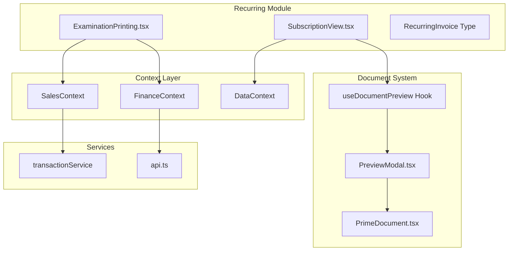

# Recurring Module & Document Preview Improvement Plan

## Executive Summary

This plan outlines improvements for the recurring billing module and its document preview functionality. The analysis covers the Examination Printing module's recurring subscription feature, the SubscriptionView component, and the PDF preview modal system.

---

## Architecture Overview



---

## Identified Issues

### 1. ExaminationPrinting.tsx - Recurring Modal Issues

| Issue | Severity | Location |
|-------|----------|----------|
| No preview before creating recurring subscription | High | Lines 1851-1965 |
| Hardcoded address in invoice preview | Medium | Line 898 |
| Missing validation for batch selection | High | handleCreateRecurring |
| No edit capability for existing recurring subscriptions | Medium | N/A |
| BOM creation duplicates without checking | Medium | Lines 755-771 |
| Missing loading state for modal actions | Low | Recurring Modal |

### 2. SubscriptionView.tsx Issues

| Issue | Severity | Location |
|-------|----------|----------|
| No detailed subscription view modal | High | Component |
| Missing billing history per subscription | High | N/A |
| Calendar only shows future runs | Medium | Lines 88-101 |
| No filter/search functionality | Medium | Component |
| Preview PDF may have incomplete data | High | Line 118, 265 |

### 3. PreviewModal.tsx Issues

| Issue | Severity | Location |
|-------|----------|----------|
| No print button - only download | Medium | Lines 67-93 |
| No zoom controls for PDF | Low | PDF Viewer |
| No email document option | Medium | N/A |
| Fixed modal size on small screens | Low | Line 51 |

### 4. PrimeDocument.tsx - EXAMINATION_INVOICE Issues

| Issue | Severity | Location |
|-------|----------|----------|
| Minimal table formatting | Medium | Lines 969-1015 |
| Missing company logo | High | N/A |
| No header section with school details | High | N/A |
| Missing term/academic year display | Medium | N/A |
| No page numbers | Low | N/A |

### 5. RecurringInvoice Type Deficiencies

| Missing Field | Purpose |
|---------------|---------|
| createdAt | Track when subscription was created |
| lastRunDate | Show last successful billing |
| totalRuns | Count of completed billing cycles |
| endDate | Optional subscription expiration |
| notes | Internal notes |
| batchId | Link to source exam batch |
| schoolId | Direct school reference |

### 6. SalesContext - runRecurringBilling Issues

| Issue | Severity | Location |
|-------|----------|----------|
| Auto-runs on data fetch without user control | High | Lines 82-86 |
| No error recovery for failed billings | High | Lines 167-169 |
| Silent failures - user not notified | Medium | Line 168 |
| No billing run history/audit | Medium | N/A |

---

## Proposed Improvements

### Phase 1: Critical Fixes

#### 1.1 Add Subscription Preview Before Creation
- Add preview step in recurring modal showing:
  - Invoice preview with actual data
  - Billing schedule visualization
  - Total amount summary

#### 1.2 Fix Hardcoded Address
- Pull address from school customer record
- Fallback to company config address

#### 1.3 Add Missing RecurringInvoice Fields
```typescript
interface RecurringInvoice {
  // ... existing fields
  createdAt: string;
  lastRunDate?: string;
  totalRuns: number;
  endDate?: string;
  notes?: string;
  batchId?: string;
  schoolId?: string;
}
```

#### 1.4 Add Validation in handleCreateRecurring
- Validate batch has items
- Validate school selection
- Validate frequency selection
- Check for duplicate subscriptions

### Phase 2: UI/UX Improvements

#### 2.1 Enhanced Subscription Detail Modal
- Full subscription details view
- Billing history timeline
- Run count and next run info
- Edit capabilities
- Pause/Resume with confirmation

#### 2.2 Enhanced PreviewModal
- Add Print button alongside Download
- Add Email option if configured
- Add zoom controls
- Responsive sizing

#### 2.3 Improved EXAMINATION_INVOICE Document
- Add company logo header
- Add school details section
- Add term/academic year
- Add batch ID reference
- Better table styling
- Page numbers

#### 2.4 Calendar Enhancement
- Show past billing events with status
- Color coding for status
- Click to view invoice

### Phase 3: Backend & Logic Improvements

#### 3.1 Controlled Billing Execution
- Remove auto-run on fetch
- Add manual trigger with confirmation
- Add scheduling option

#### 3.2 Error Handling & Recovery
- Retry failed billings
- Log failures with reason
- Notify admin of failures

#### 3.3 Audit Trail
- Log all billing runs
- Track success/failure
- Store run history per subscription

---

## Implementation Tasks

### Task 1: Update RecurringInvoice Type
**File:** `types.ts`
- Add new fields to interface
- Update mock data if any

### Task 2: Add Preview Step to Recurring Modal
**File:** `views/production/ExaminationPrinting.tsx`
- Add preview state
- Add preview component before confirmation
- Show billing schedule

### Task 3: Fix Hardcoded Address
**File:** `views/production/ExaminationPrinting.tsx`
- Update handlePreviewInvoice function
- Pull address from customer data

### Task 4: Add Validation
**File:** `views/production/ExaminationPrinting.tsx`
- Add validation before modal opens
- Show validation errors
- Disable button if invalid

### Task 5: Enhance SubscriptionView Detail Modal
**File:** `views/sales/components/SubscriptionView.tsx`
- Add detail modal component
- Show billing history
- Add edit functionality

### Task 6: Enhance PreviewModal
**File:** `views/shared/components/PDF/PreviewModal.tsx`
- Add Print button
- Add Email button
- Add zoom controls

### Task 7: Improve EXAMINATION_INVOICE Document
**File:** `views/shared/components/PDF/PrimeDocument.tsx`
- Add header with logo
- Add school details section
- Improve table styling
- Add page numbers

### Task 8: Update Finance Store
**File:** `stores/financeStore.ts`
- Handle new RecurringInvoice fields
- Update CRUD operations

### Task 9: Update SalesContext Billing Logic
**File:** `context/SalesContext.tsx`
- Remove auto-run or make configurable
- Add error recovery
- Add audit logging

### Task 10: Add Billing History Component
**File:** New file `views/sales/components/BillingHistory.tsx`
- Timeline of billing events
- Status indicators
- Links to generated invoices

---

## Testing Checklist

- [ ] Create new recurring subscription from exam batch
- [ ] Preview subscription before creation
- [ ] Edit existing subscription
- [ ] Pause/Resume subscription
- [ ] View subscription details
- [ ] View billing history
- [ ] Run billing manually
- [ ] Preview examination invoice PDF
- [ ] Download examination invoice PDF
- [ ] Print examination invoice PDF
- [ ] Verify all document fields display correctly
- [ ] Test on mobile/responsive view

---

## Dependencies

- No new npm packages required
- Uses existing PDF infrastructure
- Uses existing context/store pattern

---

## Questions for Clarification

1. Should billing auto-run on app load, or require manual trigger?
2. Is email functionality configured for sending documents?
3. Should there be a limit on recurring subscription duration?
4. Do you need ability to skip a billing cycle?
5. Should there be prorated billing for mid-cycle changes?
